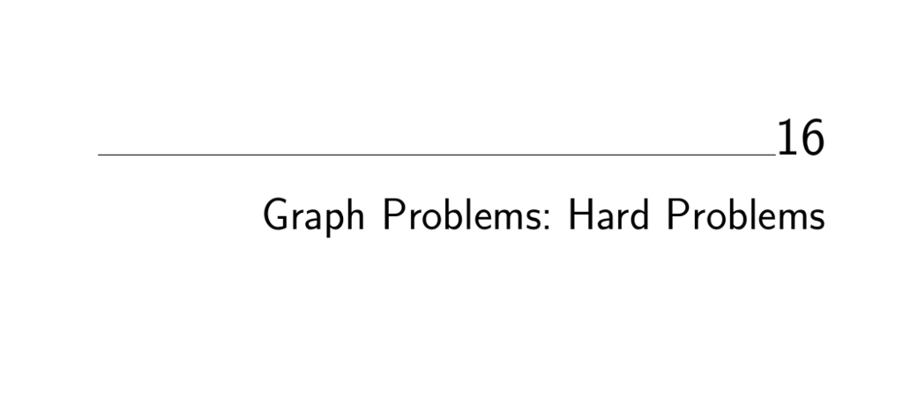

- **16. Graph Problems: Hard Problems**
  - **16.1 Clique**
    - Finding the maximum clique is NP-complete and hard to approximate within a factor of n^(1/2−ε).
    - Maximal cliques can be found efficiently but may not be large relative to the maximum clique.
    - Special cases such as planar graphs have bounded clique sizes, and heuristics like simulated annealing help find large cliques.
    - Refer to [Cliquer](http://users.tkk.fi/~pat/cliquer.html) for exact branch-and-bound implementations.
  - **16.2 Independent Set**
    - The largest set of vertices with no edges between them corresponds to the maximum independent set, which is NP-complete.
    - Independent set in a graph is equivalent to clique in the complement graph.
    - Bipartite graphs allow efficient independent set solutions; greedy and GRASP heuristics are common.
    - Consult the GRASP implementation by Resende et al. available on the ACM Collected Algorithms site.
  - **16.3 Vertex Cover**
    - The problem is to find the smallest vertex subset covering all edges, NP-complete but simpler than general set cover.
    - Vertex cover and independent set are complementary problems.
    - A 2-approximation algorithm exists by taking vertices from a maximal matching.
    - [COVER](http://www.nicta.com.au/people/richters/) provides effective stochastic local search algorithms for vertex cover.
  - **16.4 Traveling Salesman Problem**
    - Find the minimum cost cycle visiting all vertices, with variations depending on edge weights, triangle inequality, symmetry, and revisit allowance.
    - Heuristics include minimum spanning tree based tours, incremental insertion, and k-opt local improvements.
    - Concorde is the state-of-the-art solver for symmetric TSP available at [Concorde TSP](http://www.tsp.gatech.edu/concorde).
    - Polynomial-time approximation schemes exist for Euclidean TSP [Arora 1998].
  - **16.5 Hamiltonian Cycle**
    - Decide if a graph contains a cycle visiting each vertex exactly once; this is NP-complete.
    - Related to TSP with unit edge weights; efficient algorithms exist for DAGs and dense graphs.
    - Backtracking and pruning remain the primary general solution methods.
    - Refer to Vandegriend’s implementation and Concorde for related TSP reductions.
  - **16.6 Graph Partition**
    - Partition vertices into roughly equal-sized subsets minimizing the cost of edges crossing parts; problem is NP-complete.
    - Planar graphs have small separators; spectral partitioning and local improvement heuristics (e.g., Kernighan-Lin) are effective.
    - Important in parallel computing for load balancing and in data clustering.
    - [Chaco](http://www.cs.sandia.gov/~bahendr/chaco.html) and [METIS](http://glaros.dtc.umn.edu/gkhome/views/metis) are widely used partitioning tools.
  - **16.7 Vertex Coloring**
    - Assign colors to vertices so no adjacent vertices share the same color, minimizing colors; NP-complete but solvable efficiently in special cases like bipartite or planar graphs.
    - Bipartite graphs admit 2-coloring; planar graphs have known upper bounds such as four-color theorem.
    - Incremental greedy heuristics combined with color interchange improve solutions.
    - Resources include [Culberson's graph coloring page](http://web.cs.ualberta.ca/~joe/Coloring/) and the DSATUR algorithm implementation.
  - **16.8 Edge Coloring**
    - Color edges so no two edges sharing a vertex have the same color; the minimum number of colors is at most Δ + 1 where Δ is maximum vertex degree (Vizing’s theorem).
    - Edge coloring models scheduling constraints; polynomial-time algorithms exist to find near-optimal solutions.
    - Can be reduced to vertex coloring of line graphs, but direct algorithms based on Vizing’s theorem are more efficient.
    - Yan Dong’s C++ implementation and [GOBLIN](http://www.math.uni-augsburg.de/~fremuth/goblin.html) provide practical tools.
  - **16.9 Graph Isomorphism**
    - Determine if two graphs are identical up to vertex relabeling; complexity status is open (not known to be in P or NP-complete).
    - Variations include subgraph isomorphism and labeled graphs with numerous application domains.
    - Practical algorithms rely on vertex partitioning by invariants (degree, shortest path matrix) and pruning via backtracking.
    - Leading tools include [nauty](http://cs.anu.edu.au/~bdm/nauty/), VFLib, and [GraphGrep](http://www.cs.nyu.edu/shasha/papers/graphgrep/).
  - **16.10 Steiner Tree**
    - Find the smallest tree connecting a subset of vertices, possibly adding intermediate Steiner points; general problem is NP-hard.
    - Special cases include Euclidean and rectilinear Steiner trees with geometric constraints.
    - MST provides a provable approximation, with refined heuristics improving solution quality.
    - Packages like [GeoSteiner](http://www.diku.dk/geosteiner/) and FLUTE specialize in geometric Steiner trees.
  - **16.11 Feedback Edge/Vertex Set**
    - Identify a smallest set of edges or vertices whose removal renders a directed graph acyclic; used to resolve cyclic dependencies and ranking problems.
    - Feedback edge and vertex set problems are NP-complete for directed graphs; simpler algorithms exist for undirected graphs.
    - Heuristics combine vertex ordering and vertex cover approximations; GRASP implementations are available.
    - See Festa et al.’s GRASP codes and the Stanford GraphBase’s econ order program for practical applications.
