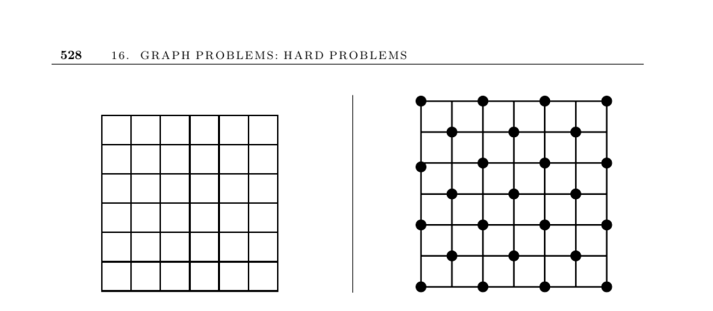

- **16.2 Independent Set**
  - **Problem Description**
    - The largest subset S of vertices is found such that no edge (x, y) ∈ E has both x and y in S.
    - This set avoids conflicts, useful in facility dispersion and coding theory applications.
    - Independent sets correspond to mutually exclusive locations or non-confusable code words.
  - **Relation to Other Problems**
    - The maximum independent set in graph G is the maximum clique in its complement graph G.
    - Each color in a vertex coloring forms an independent set, linking coloring and independent set problems.
    - Algorithms from maximum clique problems apply to independent sets by graph complementation.
  - **Heuristics and Algorithms**
    - A simple heuristic adds the lowest-degree vertex to the set, then removes it and neighbors, repeating until empty.
    - Randomization or exhaustive search can improve on this maximal independent set heuristic.
    - The maximum independent set of a tree can be found in linear time by repeatedly processing leaf nodes and their neighbors.
  - **Computational Complexity**
    - Independent set is NP-complete as proven by Karp and remains so even for planar cubic graphs.
    - It is solvable efficiently for bipartite graphs despite some subtleties.
  - **Implementations and Resources**
    - Programs for maximum clique can be adapted to find maximum independent sets using graph complements.
    - The GOBLIN library implements branch-and-bound algorithms for independent (stable) sets.
    - GRASP heuristics for independent sets are available as Algorithm 787 in the ACM Collected Algorithms.
  - **Further Reading**
    - See [GOBLIN Library](http://www.math.uni-augsburg.de/~fremuth/goblin.html) for practical implementations.
    - See [Algorithm 787 - ACM Collected Algorithms](http://www.research.att.com/~mgcr/src/) for heuristic approaches.
