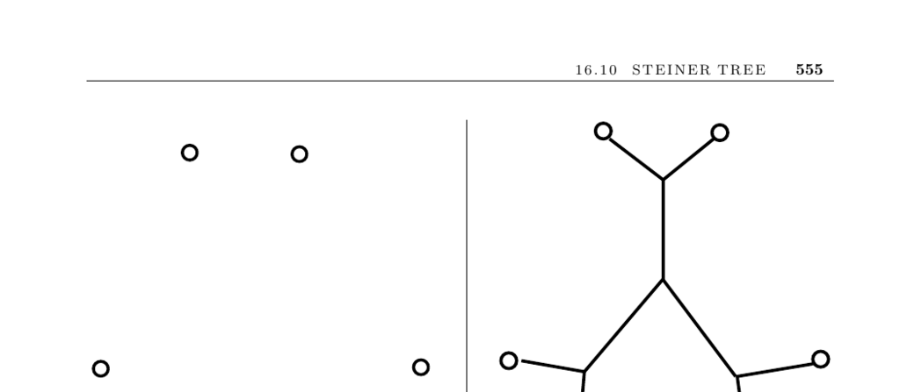

- **Steiner Tree Problem Overview**
  - The Steiner tree problem seeks the smallest tree connecting a given subset of vertices T in a graph G.
  - It differs from the minimum spanning tree problem by allowing intermediate points not in T to reduce total cost.
  - The problem is NP-hard in the general case despite some polynomial-time solvable special cases.
  - Steiner trees are widely applicable in network design, VLSI circuit design, and pipe or duct networks.

- **Key Issues in Steiner Tree Construction**
  - **Number of Points to Connect**
    - Steiner trees for pairs of vertices equate to shortest paths, and for all vertices relate to minimum spanning trees.
    - The general problem remains NP-hard with a variety of restrictions.
  - **Input Type: Geometric vs. Distance Graph**
    - Geometric Steiner problems require deducing intermediate Steiner points that meet specific geometric constraints, such as degree three and 120-degree angles.
    - Rectilinear Steiner problems restrict edges to horizontal or vertical lines, with degree constraints up to four and angles in multiples of 90 degrees.
  - **Edge Constraints**
    - Horizontal and vertical edge restrictions define the rectilinear Steiner problem with distinct angular and degree conditions.
  - **Optimality Needs**
    - Some applications justify heavy computation for optimal solutions using exhaustive search methods like backtracking or branch-and-bound.
    - Various pruning techniques are applied using geometric and graph-theoretic constraints.
  - **Reconstruction of Unknown Steiner Points**
    - Steiner points often arise in phylogenetic tree reconstructions, where internal nodes represent branching taxa.
    - Multiple reconstruction algorithms exist, varying by data modeled and optimization criteria, leading to different solutions for the same data.

- **Heuristics and Approximations**
  - **Minimum Spanning Tree Heuristic**
    - Constructing an MST on a complete distance graph of terminals provides a provably good approximation.
    - The worst-case MST approximation ratio for Euclidean Steiner trees is about 1.154 (3/2), commonly close to optimal in practice.
    - Refinements are possible by adding Steiner points at vertices with incident edges forming angles less than 120 degrees.
    - MST approximations for rectilinear Steiner trees have a minimal ratio of about 0.667.
  - **Shortest Path Based Heuristic**
    - Begin with a shortest path between two terminals and iteratively add shortest paths from remaining terminals to the growing tree.
    - The quality and runtime depend on the order of terminal insertion and efficiency of shortest path calculations.

- **Implementations and Software**
  - **GeoSteiner**
    - Solves Euclidean and rectilinear Steiner tree problems to optimality and handles large problem sizes (up to 10,000 points).
    - Available at [GeoSteiner](http://www.diku.dk/geosteiner/).
  - **FLUTE**
    - Focuses on fast computation of rectilinear Steiner trees with user-controllable tradeoffs between speed and quality.
    - Available at [FLUTE](http://home.eng.iastate.edu/~cnchu/flute.html).
  - **GOBLIN**
    - Provides heuristics and search methods for Steiner trees on general graphs.
    - Available at [GOBLIN](http://www.math.uni-augsburg.de/~fremuth/goblin.html).
  - **PHYLIP and PAUP**
    - Widely used packages for phylogenetic tree inference with numerous algorithms for arbitrary distance matrices.
    - PHYLIP: [PHYLIP](http://evolution.genetics.washington.edu/phylip.html).
    - PAUP: [PAUP](http://paup.csit.fsu.edu/).

- **Historical and Theoretical Notes**
  - The Euclidean Steiner problem dates to Fermat and was solved for three points by Torricelli before 1640.
  - Gilbert and Pollak conjectured the minimum Steiner tree to MST length ratio of ≥3/2; proven by Du and Hwang.
  - Euclidean minimum spanning trees can be constructed in O(n log n) time.
  - The Steiner tree problem is NP-hard on graphs and Euclidean/rectilinear metrics.
  - Polynomial-time approximation schemes exist for Euclidean Steiner trees in fixed dimension.
  - Physical analogs like soap films have been discussed as natural Steiner tree solvers.
  - Key references include monographs by Hwang, Richards, and Winter [HRW92], and surveys compiled by Du et al. [DSR00].
