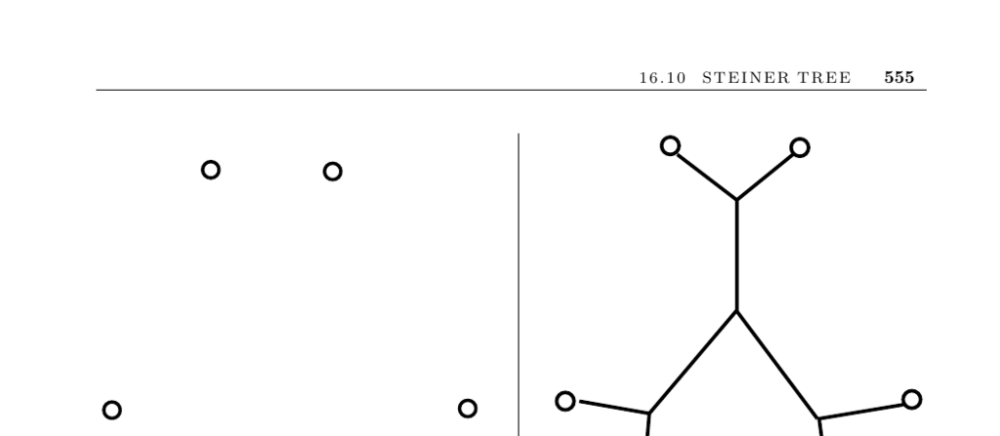

- **Input and Problem Description**
  - The problem involves a graph \(G = (V, E)\) and a subset of vertices \(T \subseteq V\).
  - The objective is to find the smallest tree that connects all vertices in \(T\).
  - Steiner trees differ from minimum spanning trees by allowing intermediate vertices to reduce total tree cost.
  - For \(T = V\), the Steiner tree corresponds to the MST of \(G\).
  - The general Steiner tree problem is NP-hard under broad restrictions.

- **Key Issues and Variants**
  - **Number of Points Connected**
    - Steiner tree for two vertices reduces to the shortest path between them.
    - When connecting all vertices (\(T = V\)), the problem becomes the MST.
    - The complexity grows significantly for general subsets of vertices.
  - **Input Type: Geometric vs Distance Graph**
    - Geometric Steiner trees involve points in the plane with unknown intermediate Steiner points.
    - Steiner points must have degree exactly three and edges meeting at 120-degree angles in Euclidean cases.
    - Rectilinear Steiner trees restrict edges to horizontal and vertical with vertices having degrees up to four and angles multiples of 90 degrees.
  - **Edge Constraints**
    - Rectilinear Steiner problems impose angular and degree restrictions differing from Euclidean cases.
  - **Optimality Requirements**
    - Applications such as circuit design justify exhaustive search methods like backtracking or branch-and-bound.
    - Pruning techniques using geometric and graph-theoretic constraints are important for search efficiency.
  - **Reconstruction of Steiner Vertices**
    - Steiner vertices can represent intermediate branching points in classifications like phylogenetic trees.
    - Multiple phylogenetic reconstruction algorithms exist, each providing potentially differing tree structures.
    - Choosing the appropriate algorithm often involves empirical evaluation.

- **Heuristics and Approximations**
  - **MST Approximation**
    - Construct a graph with edges weighted by distances between points, then find its MST to approximate the Steiner tree.
    - The MST gives a provable approximation for Euclidean and rectilinear Steiner trees.
    - Worst-case MST approximation ratio for Euclidean Steiner trees is about 3/2, while for rectilinear it is at least 2/3.
  - **Improvement by Steiner Points**
    - Steiner points can be added where MST edges meet at angles less than 120 degrees, improving solution quality.
    - Similar refinements apply for rectilinear Steiner trees.
  - **Shortest Path Heuristic**
    - Begin with shortest path between two terminals and iteratively add shortest paths from remaining terminals to the existing tree.
    - Effectiveness depends on terminal insertion order and shortest path computations.

- **Implementations and Software**
  - **GeoSteiner**
    - Solves Euclidean and rectilinear Steiner tree problems efficiently.
    - Handles large problems up to 10,000 points optimally.
    - Available at [GeoSteiner](http://www.diku.dk/geosteiner/).
  - **FLUTE**
    - Focuses on speed for rectilinear Steiner trees.
    - Allows control over trade-off between solution quality and runtime.
    - Available at [FLUTE](http://home.eng.iastate.edu/~cnchu/flute.html).
  - **GOBLIN**
    - Provides heuristics and exact search methods for Steiner trees in graphs.
    - Available at [GOBLIN](http://www.math.uni-augsburg.de/~fremuth/goblin.html).
  - **PHYLIP and PAUP**
    - Software packages for phylogenetic tree construction using multiple algorithms.
    - Support arbitrary distance matrices beyond molecular sequence data.
    - PHYLIP: [PHYLIP](http://evolution.genetics.washington.edu/phylip.html), PAUP: [PAUP](http://paup.csit.fsu.edu/).

- **Notes and Historical Context**
  - Notable monographs on Steiner trees include works by Hwang, Richards, Winter, and Prömel & Steger.
  - The Euclidean Steiner problem origins trace back to Fermat and Torricelli in the 17th century.
  - The Gilbert–Pollak conjecture on the Steiner ratio was proven by Du and Hwang.
  - Polynomial-time approximation schemes exist for Euclidean Steiner trees in fixed dimensions.
  - The Steiner tree problem is NP-hard for graphs, Euclidean, and rectilinear metrics.
  - Analogies exist between Steiner trees and physical systems such as soap films.
  - Further reading includes [Hwang, Richards, and Winter (1992)](https://example.org/hrw92), [Prömel and Steger (2002)](https://example.org/ps02), and [Du et al. (2000)](https://example.org/dsr00).
