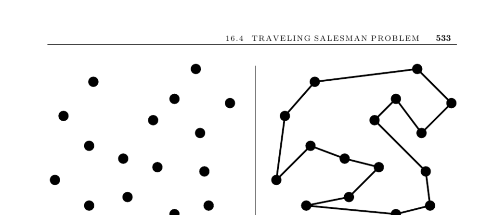

- **16.4 Traveling Salesman Problem**
  - **Input description**
    - The input is a weighted graph \(G\).
    - The goal is to find a cycle of minimum cost visiting each vertex exactly once.
    - The problem is widely applicable in transportation and manufacturing.
  - **Problem description and applications**
    - The traveling salesman problem (TSP) is NP-complete.
    - Applications include route planning for salesmen and optimizing tool paths on circuit boards.
    - Efficient tours minimize total travel distance or cost while visiting every node exactly once.
  - **Issues in solving TSPs**
    - Graph weighting affects problem complexity; unweighted graphs reduce to Hamiltonian cycle problems.
    - The triangle inequality property influences heuristic effectiveness; many geometric instances satisfy it.
    - Input format varies: geometric points often lead to complete graphs, enabling space savings by on-demand distance calculation.
    - Vertex revisit rules impact complexity; with triangle inequality, revisiting is unnecessary.
    - Symmetry of distance functions matters; asymmetric TSPs are harder to solve than symmetric ones.
    - Optimality importance guides algorithm choice between heuristics and exact methods such as cutting planes or branch-and-bound.
  - **Heuristic methods**
    - Minimum spanning tree (MST) heuristic performs depth-first traversal of MST to construct tours, providing at most twice the optimal cost.
    - Incremental insertion heuristics, especially furthest point insertion, add points to tours in positions minimizing added cost.
    - K-optimal heuristics iteratively improve tours by rewiring subsets of edges; 2-opt and 3-opt are effective and practical.
  - **Implementations and software**
    - Concorde solver is state-of-the-art for symmetric TSP and has solved large instances optimally.
    - Various software packages exist, including Tsp solve and GOBLIN, offering heuristic and exact solutions.
    - Fortran codes provide heuristics and exact solutions for asymmetric TSP instances.
    - TSPLIB offers a standard benchmark collection of TSP instances.
  - **Notes and advanced results**
    - The Christofides heuristic guarantees a tour within 3/2 times optimal for Euclidean graphs.
    - Polynomial-time approximation schemes (PTAS) exist for Euclidean TSP, providing tunable accuracy at polynomial cost.
    - Historical progress shows solving TSP instances has dramatically scaled up due to better algorithms and hardware.
    - Some problem instances are easy, such as points in convex position where the tour equals the convex hull.
    - References include [Concorde TSP Solver](http://www.tsp.gatech.edu/concorde), [TSPLIB](http://www.iwr.uni-heidelberg.de/groups/comopt/software/TSPLIB95/), and [Applegate et al., 2007](https://www.math.uwaterloo.ca/tsp/concorde.html).
