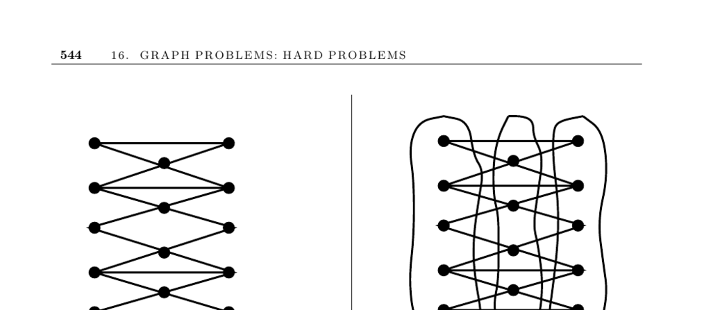

- **16.7 Vertex Coloring**
  - **Input description**
    - The input is a graph \( G = (V, E) \) for vertex coloring.
    - Vertices represent elements that must be colored so adjacent vertices differ in color.
  - **Problem description**
    - Color vertices with the minimum number of colors ensuring adjacent vertices have different colors.
    - The minimal sufficient number of colors is called the chromatic number.
  - **Discussion**
    - Vertex coloring applies to scheduling, clustering, and register allocation in compiler optimization.
    - Variables with overlapping lifespans correspond to connected vertices, and same-colored vertices indicate shared registers.
    - Use of distinct colors avoids conflicts, but minimizing colors conserves limited resources.
  - **Special cases of interest**
    - **Two-coloring: Testing bipartiteness**
      - Bipartite graphs can be colored using only two colors.
      - A simple DFS colors vertices alternatingly; failure occurs if an edge connects vertices of the same color.
      - Can be achieved in \( O(n + m) \) time; see Section 5.7.2 for an implementation.
    - **Planar graphs and low-degree vertices**
      - The four-color theorem states planar graphs can be vertex-colored with at most four colors.
      - It is NP-complete to test three-colorability even in planar graphs.
      - A simple method colors planar graphs with six colors by recursively removing vertices of degree at most five.
      - Any graph with maximum degree \( \Delta \) can be colored using at most \( \Delta + 1 \) colors in \( O(n\Delta) \) time.
    - **Edge-coloring equivalence**
      - Certain vertex coloring problems correspond to edge coloring where no two incident edges share a color.
      - Efficient algorithms exist for near-optimal edge coloring; see Section 16.8.
  - **Computational complexity and heuristics**
    - Computing the chromatic number is NP-complete, requiring backtracking for exact solutions.
    - Good approximations are hard to guarantee.
    - Incremental heuristics sequentially color vertices, often ordering by nonincreasing degree.
    - Brèlaz’s heuristic selects vertices with the highest color degree for coloring.
    - Color interchange improves heuristics by swapping colors of connected components to free colors for other vertices.
    - Simulated annealing incorporating color interchange can further enhance solutions.
  - **Implementations**
    - Culberson’s graph coloring page offers bibliographies and programs at http://web.cs.ualberta.ca/~joe/Coloring/.
    - Trick’s page provides applications and over 70 instances with DSATUR algorithm implementation http://mat.gsia.cmu.edu/COLOR/color.html.
    - DIMACS Implementation Challenge hosts programs and data for vertex coloring via anonymous FTP from dimacs.rutgers.edu.
    - GraphCol project contains tabusearch and simulated annealing heuristics in C.
    - Boost Graph Library includes greedy incremental vertex coloring heuristics in C++.
    - GOBLIN implements a branch-and-bound algorithm for vertex coloring.
    - Pascal backtracking and heuristic implementations described in [SDK83].
    - Fortran efficient backtracking implementations appear in [NW78].
    - Combinatorica package for Mathematica provides bipartite testing and backtracking coloring.
  - **Notes**
    - [SDK83] is a classical resource on vertex coloring heuristics with experimentation.
    - Proven results include Brook’s theorem bounding chromatic number by maximum degree plus one.
    - The four-color theorem solves planar graph coloring with at most four colors; efficient algorithms exist for four-coloring planar graphs.
    - It is NP-complete to decide if planar graphs require three or four colors.
    - Several surveys and results on approximation hardness and heuristics can be found in [BGS95], [Woe03], [Pas03], and [Wig83].
    - The historic four-color problem was settled by Appel and Haken in 1976 through extensive computation.
    - Efficient five-color algorithms use variations of the color interchange heuristic.
  - **Related Problems**
    - Independent set problems (see page 528).
    - Edge coloring problems (see page 548).
