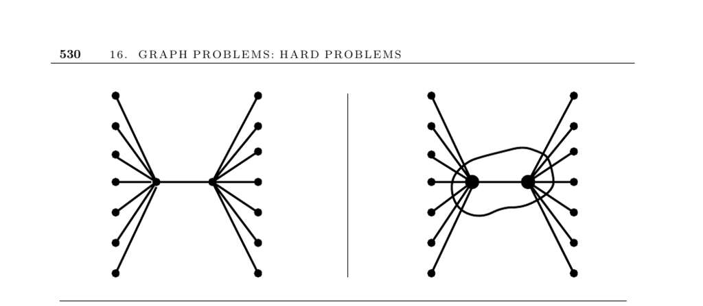

- **16.3 Vertex Cover**
  - **Problem Description**
    - The vertex cover problem seeks the smallest subset of vertices such that every edge is incident to at least one vertex in this set.
    - Vertex cover is a special case of the set cover problem, where subsets correspond to edges incident on vertices.
    - Vertex cover and independent set problems are equivalent since the complement of a vertex cover is an independent set.
    - See Section 18.1 for further details on set cover problems.
  - **Heuristics and Approximations**
    - A greedy heuristic selects the highest-degree vertex and removes its adjacent edges iteratively, running in linear time but can be lg n times worse than optimal.
    - A 2-approximation algorithm exists by finding a maximal matching and including both endpoints of each matching edge.
    - Improvements to the heuristic include selecting matching edges that cover maximum edges and removing unnecessary vertices in a second pass.
    - No known approximation better than factor 2 exists; Hastad proved no better than 1.1666 factor approximations are possible.
  - **Related Problems**
    - The dominating set problem covers all vertices with few vertices and is smaller than vertex cover in many graphs.
    - Dominating set can be formulated as a set cover problem and approximated within Θ(lg n).
    - The edge cover problem covers all vertices using the fewest edges and can be solved efficiently using maximum cardinality matchings.
  - **Implementations and Tools**
    - Maximal clique solvers apply to vertex cover by graph complementation.
    - COVER [RHG07] is a stochastic local search vertex cover solver.
    - JGraphT library provides greedy and 2-approximate vertex cover heuristics.
  - **References and Notes**
    - Vertex cover is NP-complete, as proved by Karp.
    - Several 2-approximation algorithms are known, including randomized rounding.
    - Experimental studies and heuristics are documented in [GMPV06, GW97, RHG07].
    - Dominating set problems and heuristic techniques are detailed in [HHS98, GK98].
    - Better than 2-factor approximations remain an open problem.
    - See [CLRS01], [Hoc96], [Pas97], [Vaz04] for detailed algorithms and theory.
