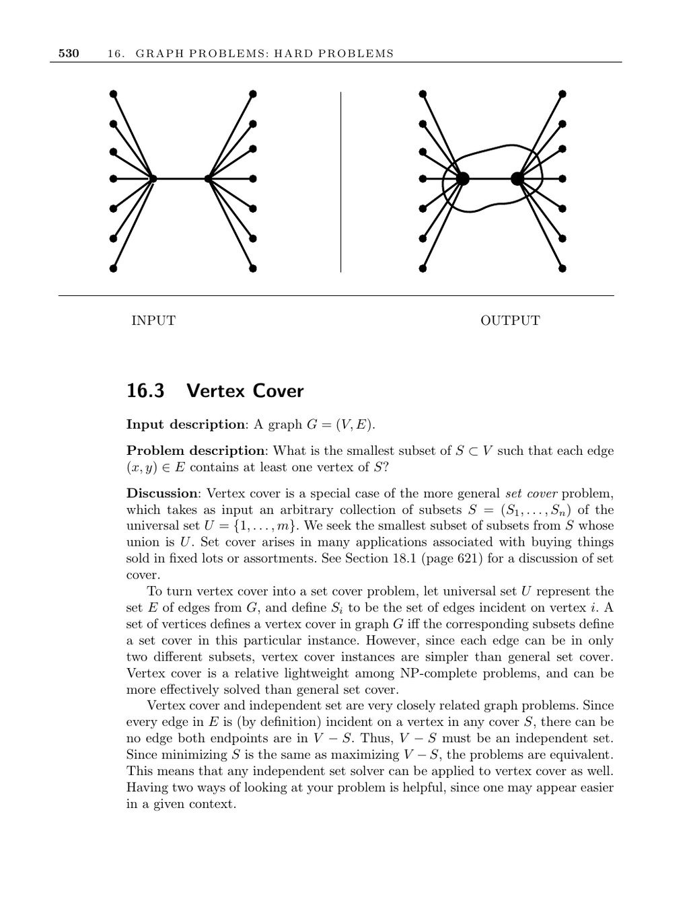

- **16.3 Vertex Cover**
  - **Problem Description**
    - The vertex cover problem seeks the smallest subset of vertices such that every edge in the graph includes at least one vertex from the subset.
    - The problem is a special case of the set cover problem where the universal set represents edges, and subsets correspond to edges incident on each vertex.
    - Vertex cover instances are simpler than general set cover because each edge belongs to only two subsets.
  - **Relation to Other Problems**
    - Vertex cover is complementary to independent set because the complement of a vertex cover is an independent set.
    - Dominating set, which seeks to cover vertices by adjacency, is related but can be smaller than vertex cover.
    - Edge cover, which covers vertices with edges, can be solved efficiently using matchings.
  - **Heuristics and Approximations**
    - A simple heuristic selects the highest degree vertex iteratively to cover edges but can be logarithmically worse than optimal.
    - A 2-approximation exists using maximal matching: selecting both endpoints of maximum matching edges yields a cover at most twice optimal.
    - Practical tweaks to heuristics include maximizing edge removal per selected matching edge and pruning unnecessary vertices.
  - **Implementations**
    - Maximum clique solvers apply to vertex cover by complementing the graph.
    - COVER is an effective vertex cover solver using stochastic local search.
    - JGraphT Java library provides greedy and 2-approximation heuristics.
  - **Complexity and Open Problems**
    - Vertex cover is NP-complete as first proved by Karp.
    - No polynomial time algorithm is known that approximates vertex cover better than factor 1.1666.
    - Whether a factor better than 2-approximation exists remains an open problem.
  - **Further Reading**
    - Approximation algorithms: [CLRS01](https://en.wikipedia.org/wiki/Introduction_to_Algorithms), [Hoc96], [Pas97], [Vaz04].
    - Experimental studies: [GMPV06], [GW97], [RHG07].
    - Dominating set monograph: [HHS98].
