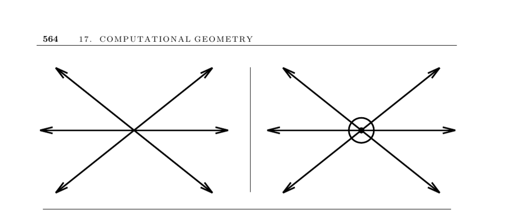

- **Robust Geometric Primitives**
  - **Input description and problem scope**
    - The input consists of a point and a line segment, or two line segments.  
    - Problems addressed include determining the position of a point relative to a line segment and deciding if two line segments intersect.  
    - Implementing these primitives involves challenges like handling parallel lines, collinearity, and near-degeneracies.  
    - [O’Rourke’s Computational Geometry in C](https://cs.smith.edu/~orourke/books/Computational_Geometry_in_C/) is recommended for practical guidance.
  - **Handling degeneracy**
    - Degeneracy refers to special geometric cases like collinear points or overlapping lines that require distinct handling.  
    - Three main approaches are ignoring degeneracies, perturbing data randomly or symbolically, and explicitly coding for special cases.  
    - Ignoring degeneracy suits short-term projects but fails on grid-sampled or degenerate data.  
    - Symbolic perturbation removes degeneracies consistently but involves complexity.  
  - **Numerical stability approaches**
    - Numerical errors arise due to floating-point arithmetic limitations and overflow risks.  
    - Using integer arithmetic on a fixed grid ensures exact equality tests but may limit representable intersection points.  
    - Double precision floating-point can reduce errors but is not guaranteed.  
    - Arbitrary precision arithmetic guarantees correctness but at significant performance cost.  
    - Research continues on optimizing robust and efficient geometric computations.  
  - **Core geometric primitives**
    - The signed area of a triangle can be efficiently computed using a determinant formula avoiding trigonometric calculations.  
    - The above-below-on test uses the sign of the triangle area to determine a point’s position relative to a directed line.  
    - The line segment intersection test applies the above-below test to endpoints to detect intersections.  
    - The in-circle test uses a determinant to decide if a point lies inside, on, or outside the circle defined by three points.  
  - **Implementations and resources**
    - CGAL and LEDA provide comprehensive, production-quality C++ geometric primitive libraries.  
    - O’Rourke’s C implementations offer readable and reliable primitives for small applications.  
    - The Core Library supports exact geometric computation with adjustable precision levels.  
    - Shewchuk’s robust C++ implementations address numerical stability in geometric primitives.  
    - Further studies and improvements on robustness appear in works by Yap, Kettner et al., Shewchuk, and Fortune and van Wyk.  
  - **Notes and related problems**
    - Robust primitives are foundational for higher-level tasks like intersection detection and arrangement maintenance.  
    - Controlled perturbation techniques offer promising robust computation methods.  
    - [CGAL](https://www.cgal.org) and [LEDA](http://www.algorithmic-solutions.com) are key libraries to consider before custom implementations.
