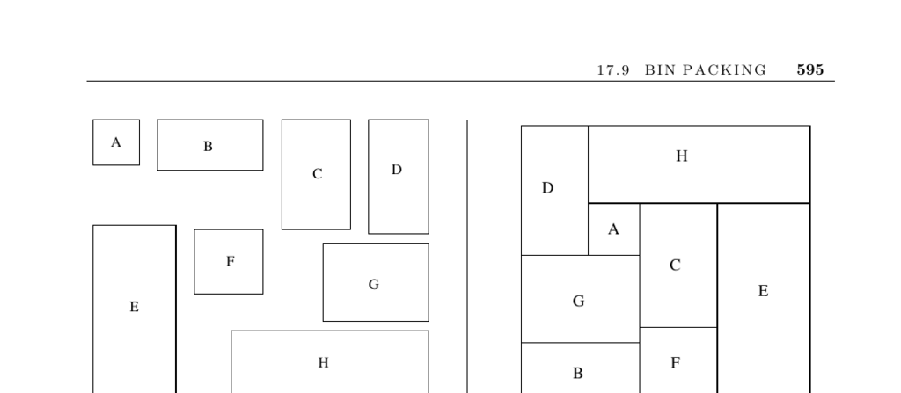

- **Input and Problem Description**
  - The input consists of n items with sizes and m bins with specified capacities.
  - The objective is to store all items using the smallest number of bins possible.
  - Bin packing applies to manufacturing and packaging problems, such as cutting stock and shipping logistics.
  - Bin packing problems are NP-complete and typically addressed using heuristics.
- **Factors Affecting Heuristic Choice**
  - Object shapes and sizes greatly influence the packing approach and complexity.
  - Constraints on orientation and placement impact packing flexibility and bin utilization.
  - The distinction between on-line and off-line problems affects planning and packing efficiency.
  - Sorting objects from largest to smallest usually improves packing results.
- **Standard Heuristics and First-Fit Decreasing**
  - Objects are sorted in decreasing order of size before insertion.
  - Each object is placed in the first bin with sufficient room; new bins open if needed.
  - First-fit decreasing requires at most 22% more bins than the optimal solution.
  - Implementation time is O(n log n + bn) or faster with tree data structures.
- **Handling Problem-Specific Constraints**
  - Orientation and stacking constraints can be managed by adjusting insertion order.
  - Placing fixed-orientation boxes first and sensitive boxes last optimizes packing.
  - Flexibility in packing is improved by reserving space for particular constraints.
- **Packing Arbitrary Shapes**
  - General method: enclose each shape in a minimum bounding box before packing.
  - Finding minimum bounding boxes in 2D and 3D can be computationally intensive but feasible.
  - Nonconvex parts waste space due to internal holes; maximum empty rectangles may improve utilization.
  - More advanced methods exist and are cited in the text for improved packing.
- **Implementations and Resources**
  - Fortran implementations of knapsack and bin-packing variants are available from Martello and Toth.
  - David Pisinger maintains C-language codes for knapsack problems and variants.
  - Approximation algorithms for optimal packing of arbitrary shapes exist and run near-linearly.
- **Notes and Related Problems**
  - Extensive literature surveys exist covering bin packing and the cutting stock problem.
  - Efficient algorithms exist for finding largest empty rectangles in polygons and point sets.
  - Sphere packing is a well-studied special case with applications in coding theory.
  - Related problems include the knapsack problem and set packing, with references provided.
