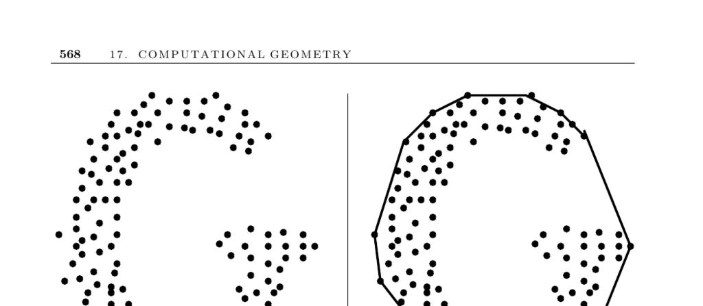

- **Convex Hull**
  - **Problem Description**
    - Finds the smallest convex polygon or polyhedron containing all points in a set S in d-dimensional space.
    - Convex hull represents a rough idea of the shape or extent of a data set.
    - Used as a preprocessing step in many geometric algorithms, such as computing the diameter of a point set.
    - The rotating-calipers method efficiently finds diametrically opposed hull vertices.
  - **Dimensionality Considerations**
    - Convex hulls in two and three dimensions are easier to work with; assumptions in lower dimensions break down in higher dimensions.
    - The relationship between faces and vertices becomes more complex in higher dimensions.
    - Gift-wrapping is the basic algorithm for constructing convex hulls in high dimensions.
    - Gift-wrapping runs in O(nφd−1 + φd−2 log φd−2), which can be as bad as O(n^(d/2 + 1)) for complex hulls.
  - **Input Type: Vertices vs Half-Spaces**
    - The intersection of half-spaces problem is dual to the convex hull problem of points.
    - Duality transformation for half-spaces and hulls is discussed in Section 17.15.
    - Half-plane intersections may be infeasible if no interior point exists.
  - **Number of Points on the Hull**
    - Typically, most points lie inside the hull in random data sets.
    - Extreme points (leftmost, rightmost, topmost, bottommost) must be on the hull, allowing interior points to be discarded.
    - This preprocessing reduces the number of points for the full hull algorithm.
    - The effectiveness of this pruning diminishes with increasing dimensions.
  - **Shape Approximation Beyond Convex Hulls**
    - Convex hulls lose details of concavities.
    - Alpha-shapes provide a parameterized structure to include concavities.
    - Alpha-shapes implementations and references are available.
  - **Key Planar Algorithms**
    - Graham scan: sorts points angularly around a known hull point and constructs the hull in O(n log n) time.
    - Non-self-intersecting polygons can be constructed by connecting points in angular order.
    - Gift-wrapping (Jarvis march) in 2D walks around the hull and runs in O(nh) time, with h vertices on the hull.
    - Graham scan is preferred unless the number of hull vertices is known to be small.
  - **Implementations**
    - CGAL library offers C++ implementations for convex hulls in various dimensions.
    - LEDA provides alternate C++ planar convex hulls.
    - Qhull is a popular C implementation optimized for 2 to 8 dimensions; includes functionality beyond convex hulls.
    - O’Rourke provides robust Graham scan 2D and incremental 3D convex hull implementations in C and Java.
    - Alpha-shapes code available at biogeometry.duke.edu; Hull performs alpha-shapes and higher-dimensional hulls.
    - Avis’s lhs implements a reverse search algorithm for vertex enumeration and convex hulls in higher dimensions.
  - **Notes and Theoretical Foundations**
    - Convex hull is fundamental in computational geometry, akin to sorting in algorithm theory.
    - Quickhull and mergehull draw inspiration from sorting algorithms.
    - Planar convex hull has an Ω(n log n) lower bound due to reduction from sorting.
    - Optimal planar hull algorithm runs in O(n log h) time, where h is hull vertices.
    - Convex hulls can be computed in-place without additional memory.
    - Surveys and expositions referenced include Seidel (up-to-date), Graham (original), Jarvis, and others.
    - Alpha-hulls generalize convex hulls to capture shape concavities.
    - Reverse-search algorithms enhance higher-dimensional hull computation.
    - Convex hull relates to Voronoi diagrams via lifting maps.
    - Dynamic hull data structures support insertions/deletions in poly-logarithmic amortized time.
  - **Related Problems**
    - Sorting algorithms relate to convex hull complexity and methods.
    - Voronoi diagram construction can reduce to convex hull computations.
  - **Further Reading and Resources**
    - CGAL: [www.cgal.org](https://www.cgal.org)
    - Qhull: [http://www.qhull.org/](http://www.qhull.org/)
    - Alpha-shapes software: [http://biogeometry.duke.edu/software/alphashapes/](http://biogeometry.duke.edu/software/alphashapes/)
    - Hull: [http://www.netlib.org/voronoi/hull.html](http://www.netlib.org/voronoi/hull.html)
    - Avis’s lhs: [http://cgm.cs.mcgill.ca/~avis/C/lrs.html](http://cgm.cs.mcgill.ca/~avis/C/lrs.html)
    - O’Rourke’s convex hull implementations mentioned in Section 19.1.10
