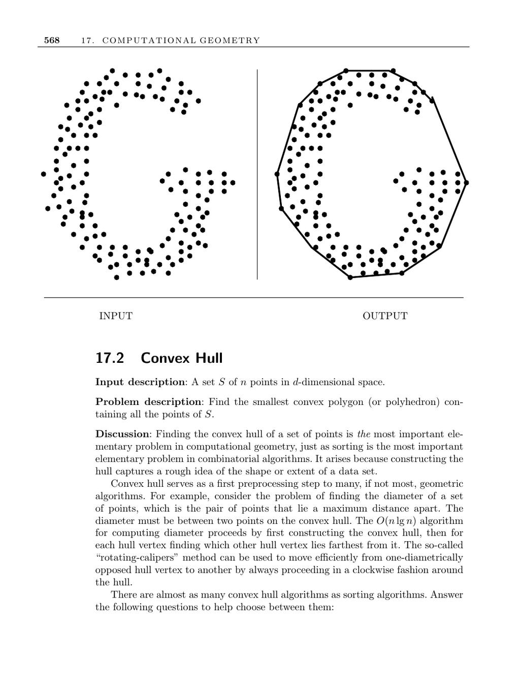

- **17.2 Convex Hull**
  - **Problem Description and Importance**
    - The convex hull is the smallest convex polygon or polyhedron containing all points in a set S.
    - Constructing the hull captures the shape or extent of a data set and is a fundamental preprocessing step in many geometric algorithms.
    - The hull is crucial for related problems such as finding the diameter of a point set.
  - **Algorithmic Considerations**
    - Convex hull algorithms vary significantly across dimensions; two- and three-dimensional cases are simpler.
    - The gift-wrapping algorithm generalizes to higher dimensions but can be computationally expensive.
    - The complexity of the hull structure increases with dimension, affecting data structures and algorithm choice.
  - **Data Representation and Duality**
    - Convex hull computation is dual to finding intersections of half-spaces containing the origin.
    - Duality transformations allow similar algorithms to address hulls and half-space intersections.
    - Feasibility differs when no interior point exists in half-space intersection problems.
  - **Optimizations Based on Hull Size**
    - Many points often lie inside the hull, allowing interior points to be discarded using bounding quadrilateral heuristics.
    - This optimization is more effective in low dimensions and reduces points considered by the full hull algorithm.
  - **Shape Representation Beyond Hulls**
    - Convex hulls omit concavities and finer shape details.
    - Alpha-shapes generalize hulls to retain concavities and provide a more detailed shape representation.
  - **Key Algorithms**
    - The Graham scan sorts points by angle and builds a convex hull in O(n log n) time, removing vertices that violate convexity.
    - The gift-wrapping (Jarvis March) algorithm runs in O(nh) time by walking around hull edges and is simpler in 2D.
    - The O(n log h) optimal planar hull algorithm improves on both Graham scan and gift-wrapping when h is the number of hull vertices.
  - **Implementations and Software**
    - CGAL provides C++ implementations for convex hulls in various dimensions.
    - Qhull efficiently handles hulls up to about eight dimensions and supports related structures.
    - O’Rourke offers robust Graham scan and incremental 3D hull implementations in C and Java.
    - Edelsbrunner’s alpha-shapes code is available for advanced shape detection.
    - Avis’s lhs implements a reverse search algorithm for vertex enumeration and hull computations in high dimensions.
  - **Theoretical Notes**
    - Planar convex hulls have a lower bound of Ω(n log n) time due to a reduction from sorting.
    - Graham scan and Jarvis march are classical algorithms with extensive literature.
    - Dynamic data structures support insertions and deletions with amortized near-logarithmic time.
    - Voronoi diagrams in d dimensions can be constructed using convex hulls in d+1 dimensions.
  - **Further Reading**
    - [CGAL](https://www.cgal.org)
    - [Qhull](http://www.qhull.org/)
    - [Alpha Shapes Software](http://biogeometry.duke.edu/software/alphashapes/)
    - [Avis LRS Algorithm](http://cgm.cs.mcgill.ca/~avis/C/lrs.html)
    - O’Rourke, J. *Computational Geometry in C*
