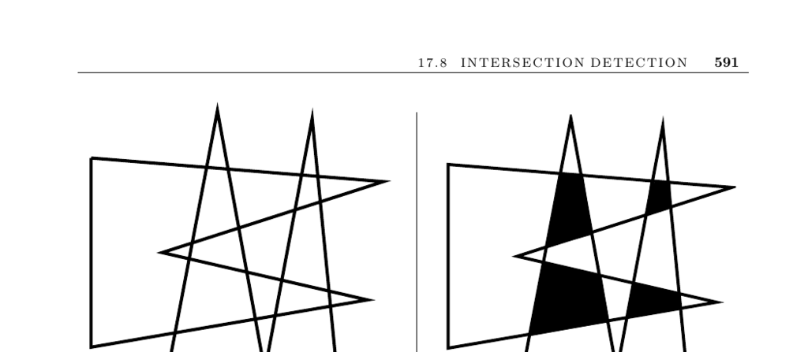

- **Intersection Detection**
  - **Input Description and Problem Statement**
    - Input consists of sets of lines, line segments, or pairs of polygons/polyhedra.
    - The problem is to identify intersecting pairs of line segments or the intersection of polyhedra/polygons.
    - Intersection detection is crucial for applications such as virtual-reality collision detection and VLSI layout checking.
  - **Issues in Intersection Detection**
    - Distinguishes between detecting intersection existence versus computing exact intersections.
    - Intersection behavior differs between infinite lines (one intersection if slopes differ) and line segments (more complex).
    - Algorithms exist with output-sensitive runtimes depending on number of intersections (k), e.g., O(n log n + k).
    - Visibility queries reduce to line-segment intersection problems in obstacle environments.
    - Convex shapes allow more efficient intersection algorithms, with O(n + m) time for convex polygon intersections.
    - Nonconvex polygons may have disconnected intersections and potentially quadratic complexity.
    - Polyhedra intersection is more complex as intersections can occur without edge intersection.
    - Repeated intersection queries benefit from enclosing simple bounding objects (e.g., boxes) for efficiency.
  - **Planar Sweep Algorithms**
    - Use a vertical sweep line moving left to right to detect intersections efficiently.
    - Events processed include insertion (segment start), deletion (segment end), and intersection (segments swap).
    - Data structures used: event queue (priority queue by x-coordinate) and horizon data structure (balanced tree).
    - For convex polygons, the sweep simplifies due to limited edges intersecting the sweep line and polygonal ordering.
  - **Implementations and Resources**
    - The Bentley-Ottmann algorithm finds all k intersections in O((n + k) log n) time.
    - Libraries supporting intersection algorithms include LEDA and CGAL with C++ implementations.
    - O’Rourke provides a robust C program for convex polygon intersection.
    - UNC’s GAMMA group offers the SWIFT++ library for collision detection of rigid polyhedra.
    - Qhull is the standard tool for finding convex hulls and half-space intersections.
    - Further surveys and books include works by Mount, de Berg et al., and Preparata & Shamos.
    - Advanced algorithms for line-segment intersection include Chazelle and Edelsbrunner’s optimal algorithm and Mulmuley’s randomized approaches.
    - Lin and Manocha provide a comprehensive survey on collision detection techniques.
    - [CGAL](https://www.cgal.org)
    - [Bentley-Ottmann Algorithm](https://en.wikipedia.org/wiki/Bentley%E2%80%93Ottmann_algorithm)
    - [Qhull](http://www.qhull.org/)
    - [Mount Survey on Intersection Algorithms](https://doi.org/10.1007/s00454-004-1148-8)
