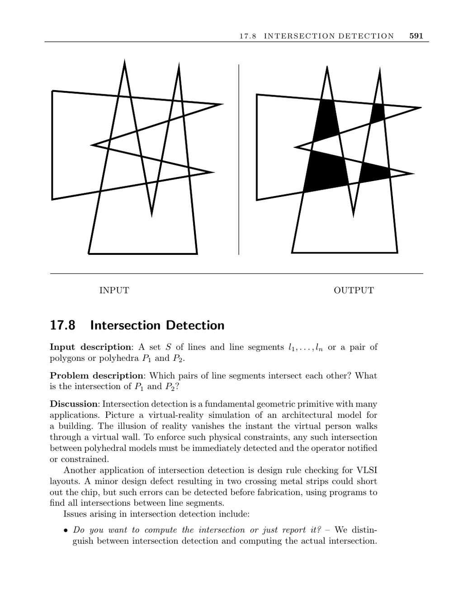

- **Intersection Detection**
  - **Input Description and Problem Statement**
    - Inputs include sets of lines, line segments, or pairs of polygons/polyhedra.
    - Problems involve identifying intersecting pairs or computing intersections between shapes.
    - Applications range from virtual reality to VLSI design-rule checking.
  - **Key Issues in Intersection Detection**
    - Distinguishes between detecting intersection existence versus computing exact intersections.
    - Intersecting lines differ from line segments; lines intersect at one point but segments require more complex checks.
    - Output-sensitive algorithms run in O(n lg n + k) time, where k is the number of intersections.
    - Visibility queries transform to line-segment intersection problems relevant to motion planning and graphics.
    - Convexity of polygons affects algorithm complexity; convex polygon intersections are simpler than nonconvex cases.
    - Polyhedra intersections are more complicated due to possible interior face penetrations.
    - Repeated intersection queries benefit from bounding-box approximations for efficiency.
  - **Planar Sweep Algorithms for Intersection**
    - Use a vertical sweep line moving left to right over the segments or polygons.
    - Three event types drive the algorithm: insertion (segment start), deletion (segment end), and intersection (between neighboring segments).
    - Employ two data structures: an event priority queue sorted by x-coordinate and a balanced tree representing the sweepline horizon.
    - Simplified approaches exist for convex polygons, removing the need for complex data structures or event queue sorting.
  - **Implementations and Resources**
    - Bentley-Ottmann algorithm finds all intersections in O((n + k) lg n) time, implemented in LEDA and CGAL libraries.
    - Robust C implementations available for convex polygon intersections ([O’Rourke 2001](#)).
    - UNC GAMMA group's SWIFT++ library supports collision detection for polyhedral models.
    - Qhull software addresses intersection problems as special cases of convex hull computations.
    - Further algorithm surveys and details are in references such as [Mount 2004](#), [Preparata and Shamos 1985](#), and Chazelle and Edelsbrunner’s optimal algorithm.
  - **Related Problems**
    - Maintaining arrangements (see page 614) and motion planning (see page 610) build on intersection detection concepts.
