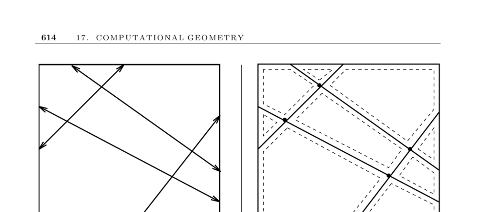

- **17.15 Maintaining Line Arrangements**
  - A line arrangement decomposes the plane into regions formed by the intersections of a set of n lines or line segments.
  - Incremental algorithms insert lines one at a time by walking from the leftmost cell and splitting affected cells, achieving O(n²) construction time due to the zone theorem.
  - Applications include degeneracy testing (detecting triple intersections) and maximizing the number of satisfied linear constraints by evaluating one point per cell.
  - Duality transformations convert points to lines and vice versa, enabling point problems to be solved via line arrangements.
  - Robust implementations and further details are available in CGAL and by references such as Edelsbrunner [Ede87] and surveys [AS00, Hal04].

- **17.16 Minkowski Sum**
  - The Minkowski sum of two point sets or polygons A and B is the set of all vector sums x + y for x in A and y in B.
  - Minkowski sums fatten objects and have applications including motion planning, shape simplification, and boundary smoothing.
  - The operation geometrically corresponds to the union of all translations of A by points in B.
  - Handling rasterized images differs from explicit polygons in computational approaches.
  - Further reading includes related sections on motion planning (Section 17.14) and shape simplification (Section 17.12).
