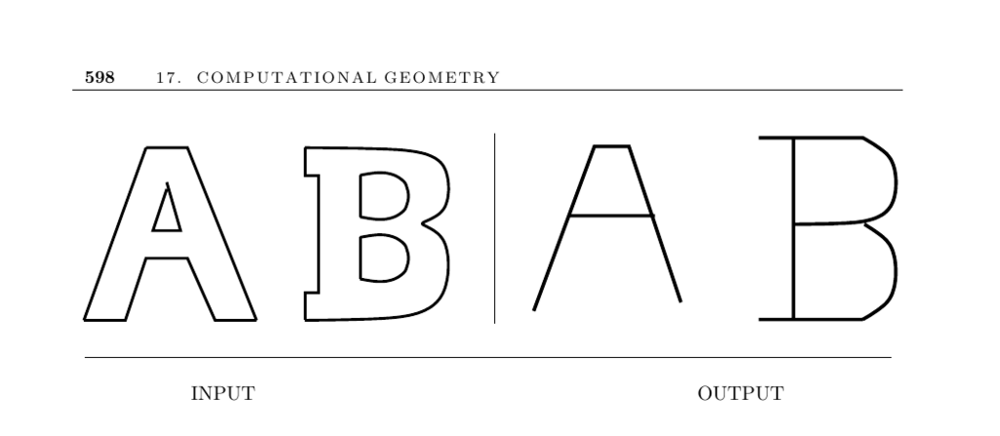

- **Medial-Axis Transform**
  - **Input description: A polygon or polyhedron P**
    - The input is a polygon or polyhedron defined by a collection of line segments.
    - The polygon may include holes, affecting the form of the medial axis.
    - Input representation influences the computation approach for the medial-axis transform.
  - **Problem description: Points with multiple closest boundary points**
    - The medial axis consists of points inside P with more than one closest boundary point.
    - These points define the shape's skeleton or thinned representation.
    - The skeleton helps identify the shape’s center and supports applications such as shape reconstruction.
  - **Discussion: Uses and properties of medial-axis transforms**
    - The transform yields a simple, robust shape representation useful in thinning and skeletonization.
    - For polygons without holes, the medial axis is a tree; with holes, it is an embedded planar graph.
    - Medial axes enable measuring edit distances between skeletons for shape recognition and classification.
    - Relevant to applications like computer vision and optical character recognition.
    - [De Berg et al., "Computational Geometry"](https://example.org) offers further details on medial-axis use.
  - **Computing medial-axis transforms**
    - **Geometric data approach**
      - Constructs the medial axis via the portion of the Voronoi diagram of polygon edges lying inside P.
      - Voronoi diagrams of line segments segment the plane by proximity to edges.
      - The straight skeleton is a related structure, easier to compute and polygonal but not always centered.
      - CGAL provides implementations for straight skeleton and offset contours.
      - See VRONI for efficient Voronoi diagrams of line segments: [VRONI Project](http://www.cosy.sbg.ac.at/~held/projects/vroni/vroni.html).
    - **Image data approach**
      - Approximates the polygon from pixel lattices and applies pixel-based thinning algorithms.
      - Employs a "brush fire" method simulating inward boundary burning to detect skeleton points.
      - Pixel-based methods are simpler but lack exact geometric properties, resulting in possible disconnected or approximate skeletons.
      - Pixel-based skeleton extraction operates in linear time relative to the image pixel count.
  - **Implementations**
    - CGAL offers polygon straight skeleton computation and offset contour routines.
    - VRONI efficiently computes Voronoi diagrams of line segments for medial-axis extraction in polygons.
    - Cocone approximates medial-axis transforms for polyhedral surfaces from point clouds in 3D.
    - Powercrust uses discrete medial axis approximations for surface reconstruction from dense point samples.
    - Related software links: [Cocone](http://www.cse.ohio-state.edu/~tamaldey/cocone.html), [Powercrust](http://www.cs.utexas.edu/users/amenta/powercrust/).
  - **Notes**
    - Thinning methods in image processing are surveyed in [LLS92, Ogn93].
    - Medial-axis introduced for biological shape similarity in [Blu67].
    - Pattern recognition applications reviewed in [DHS00].
    - Algorithms run in O(n log n) for general polygons and linear time for convex polygons.
    - Straight skeleton algorithms introduced in [AAAG95] with improvements in [EE99].
    - Uses include defining roof structures in virtual models [LD03].
    - Additional references provide comprehensive algorithmic and theoretical background, e.g., [dBvKOS00, O’R01, Pav82].
  - **Related problems**
    - Connection to Voronoi diagrams (see page 576).
    - Relation to Minkowski sums (see page 617).
