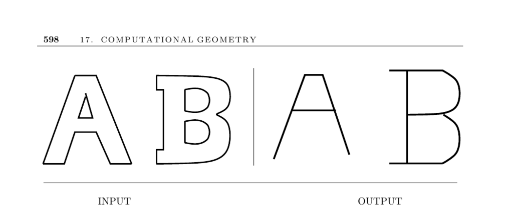

- **Medial-Axis Transform**  
  - The medial-axis transform identifies points within a polygon or polyhedron that have more than one closest boundary point.  
  - It produces a skeletal representation useful for shape analysis, thinning, and preserving fundamental shape features despite thickness or decorative changes.  
  - The resulting medial axis of a polygon without holes is always a tree; with holes, it forms an embedded planar graph.  
  - Computing approaches differ for geometric data (using Voronoi diagrams of line segments) and image data (using pixel-based "brush fire" thinning).  
  - For more details on computations and applications, see [CGAL](https://www.cgal.org) and [VRONI](http://www.cosy.sbg.ac.at/~held/projects/vroni/vroni.html).  

- **Geometric Data Approaches**  
  - The Voronoi diagram of a polygon’s line segments inside the polygon defines its medial-axis transform.  
  - The straight skeleton is related but bisectors are equidistant to supporting lines rather than edges; it is easier to compute and polygonal.  
  - For convex polygons, medial axis, straight skeleton, and Voronoi diagrams coincide.  
  - Straight skeleton edges are always polygonal, simplifying computation relative to the medial axis transform.  
  - See references in the Notes section for algorithms and computational details.  

- **Image Data Approaches**  
  - Pixel-based skeleton construction uses a "brush fire" model simulating fires burning inward at edges and meeting at the skeleton.  
  - This approach progresses by identifying boundary pixels part of the skeleton, deleting others, and repeating until a thin skeleton remains.  
  - Pixel-based methods run in linear time relative to the number of image pixels and are simpler to implement.  
  - Such methods produce skeletons that may not be trees, fully connected, or exactly equidistant to boundaries due to discrete grid limitations.  
  - Practical skeletal extractions in images inherently approximate continuous geometry in a discrete domain.  

- **Implementations and Tools**  
  - CGAL provides packages for computing straight skeletons and offset contours within polygons.  
  - VRONI efficiently computes Voronoi diagrams of points, line segments, and arcs, supporting medial-axis transforms of polygons with large datasets.  
  - Cocone reconstructs approximate medial-axis transforms of polyhedral surfaces from 3D point samples.  
  - Powercrust constructs discrete approximations of medial-axis transforms for surface reconstruction, yielding guaranteed correct topological results with dense samples.  
  - See the associated websites for downloads and documentation of these implementations.  

- **Notes and References**  
  - The medial-axis transform was introduced for biological shape similarity studies and later adapted for pattern recognition.  
  - It supports algorithms computing medial axes in O(n log n) time, with linear-time solutions in convex cases.  
  - Straight skeletons originated in the 1990s with subsequent subquadratic algorithms.  
  - Applications include object classification, character recognition, and roof structure modeling in virtual environments.  
  - Comprehensive surveys and foundational papers include [LLS92], [Dey06], and [AAAG95].
