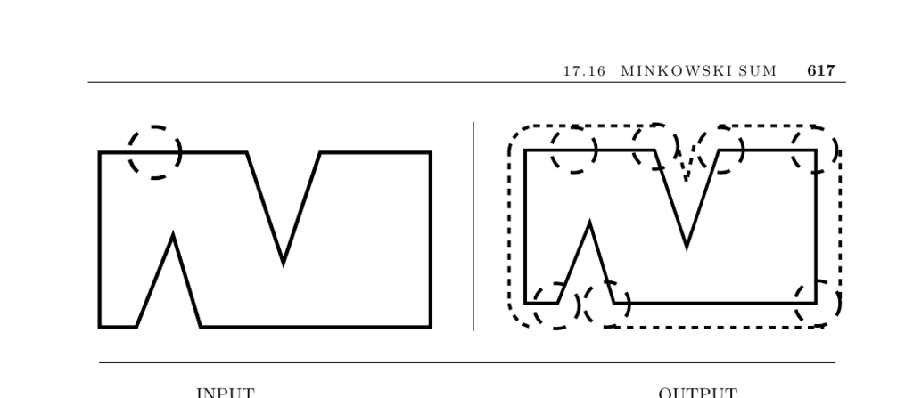

- **Minkowski Sum**
  - **Input and Problem Description**
    - The Minkowski sum A + B is defined as {x + y | x ∈ A, y ∈ B}, where x + y is the vector sum of two points.
    - Input consists of point sets or polygons A and B, containing n and m vertices respectively.
    - The Minkowski sum is commonly used to fatten objects by appropriate geometric operations.
  - **Applications and Discussion**
    - Minkowski sums aid motion planning by fattening obstacles with the robot shape to simplify collision checks.
    - Other applications include shape simplification by creating channels around objects and smoothing boundaries via convolution with a small circle.
    - Polygon positioning on coordinate systems is necessary for computing Minkowski sums.
  - **Computational Issues and Considerations**
    - Rasterized images allow simple algorithms by summing coordinate pixels, while polygonal representations require more complex processing.
    - Offsetting by a fixed amount corresponds to Minkowski sum with a disk of given radius; its boundary consists of circular arcs and line segments.
    - Convex polygons enable O(n + m) time computability; nonconvex polygons lead to potentially large sums with worst-case complexity growing as Θ(n m) or Θ(n² m²).
  - **Algorithms and Methods**
    - Triangulate both polygons and compute Minkowski sums for each triangle pair, then take their union to obtain the final sum.
    - For convex polygons, slide one polygon along the boundary of the other and sum edge by edge for efficient computation.
    - Partitioning polygons into convex pieces typically improves efficiency over full triangulation.
    - Union algorithms use plane sweep techniques as detailed in related sections.
  - **Implementations and Further Resources**
    - The CGAL Minkowski sum package provides efficient, robust algorithms for arbitrary polygons and exact or approximate offsets.
    - A 3D convex polyhedra Minkowski sum implementation is described in [FH06] and available online.
    - Foundational algorithm references include [dBvKOS00, O’R01], with fastest cases treated in [KOS91, Sha87].
    - Decomposition into convex pieces impacts practical efficiency, with studies such as [AFH02] providing thorough analysis.
    - The combinatorial complexity of Minkowski sums for convex polyhedra in 3D is resolved in [FHW07].
  - **Related Problems**
    - Minkowski sums relate closely to thinning, motion planning, and polygon simplification techniques.
