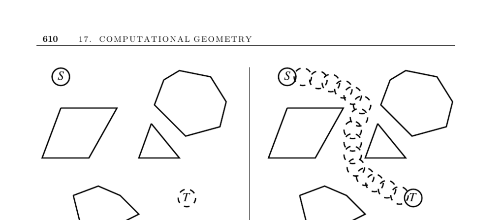

- **17.14 Motion Planning**
  - **Input description**
    - The input consists of a polygonal-shaped robot starting at position s and a goal position t in a room containing polygonal obstacles.
    - The core problem is to find the shortest route from s to t that avoids intersecting any obstacles.
  - **Discussion**
    - Motion planning is complex and arises in practical scenarios like moving furniture, molecular docking, and robot path planning.
    - It is also used in computer animation to interpolate scenes by constructing intermediate motions between object models.
  - **Factors governing complexity**
    - Whether the robot is a point or polygon affects the complexity and algorithms used.
    - The robot’s degrees of freedom, including translation and rotation, impact the search space dimension.
    - Simplifying the robot’s shape, e.g., enclosing it in a disk, can reduce complexity.
    - Limiting motions to translation allows expanded obstacle methods using Minkowski sums.
    - Knowledge of the environment, such as known obstacles or moving obstacles, influences the approach.
  - **Point robot motion planning**
    - Constructs the visibility graph connecting obstacle vertices plus start and goal points.
    - Visibility graph edges represent pairs of vertices visible to each other without obstruction.
    - Shortest path is found by applying Dijkstra’s algorithm on this weighted graph.
    - Faster visibility graph algorithms exist beyond the naive O(n²) approach.
  - **Polygon robot motion planning**
    - Corridors must be wide enough to permit passage of the polygonal robot.
    - Degrees of freedom correspond to configuration space dimensions; increased freedoms increase complexity but improve path existence.
  - **Simplification and expanded obstacles**
    - Replacing the robot with an enclosing disk simplifies rotation considerations.
    - Expanded obstacles use Minkowski sums to convert polygon motion planning into a point-robot problem.
  - **Unknown or dynamic environments**
    - Two main approaches: map-building exploration or reactive navigation (“sightless man” method).
    - Reactive methods fail in complex environments.
  - **Random sampling in configuration space**
    - Samples legal robot poses considering all degrees of freedom.
    - Connects pairs of configurations if a direct collision-free path exists, building a roadmap graph.
    - The shortest path on this graph solves the motion planning problem.
    - Enhancements include focusing samples in important regions.
  - **Implementations and resources**
    - The Motion Planning Toolkit (MPK) includes probabilistic roadmap planners like SBL.
    - UNC’s GAMMA group offers collision detection libraries such as SWIFT++.
    - The CGAL library provides algorithms for visibility graphs and Minkowski sums.
    - O’Rourke’s work includes two-jointed robot arm algorithms; see [O’Rourke 2001].
    - Further reading includes books by Latombe, LaValle ([LaV06](http://planning.cs.uiuc.edu/)), and Laumond ([Lau98](http://www.laas.fr/~jpl/book.html)).
  - **Historical and theoretical background**
    - The “piano mover’s problem” studies free space of robot positions and shortest path therein.
    - Free space geometry involves complex arrangements of algebraic surfaces.
    - Canny’s algorithm solves d-DOF motion planning in O(nd log n) time.
    - Expanded obstacle method credited to Lozano-Perez and Wesley.
    - Lumelski studied the heuristic “sightless man” approach.
    - Davenport-Schinzel sequences arise in free space complexity analyses.
    - Visibility graph construction can be achieved optimally in O(n log n + E) time.
    - Hershberger and Suri achieve O(n log n) shortest-path algorithms for point-robots.
    - Chew provides O(n² log n) algorithms for disk-robot shortest paths.
