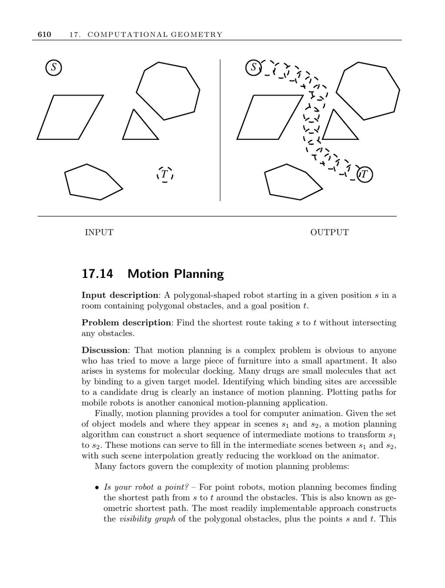

- **Motion Planning**
  - **Input Description**
    - The input consists of a polygonal-shaped robot starting at a given position s in a room with polygonal obstacles and a goal position t.
    - The problem is to find the shortest collision-free route from s to t.
  - **Problem Description**
    - Motion planning requires finding paths for robots to navigate environments without intersecting obstacles.
    - Applications include moving furniture, molecular docking, and mobile robot path planning.
    - It also supports computer animation by interpolating intermediate scenes between object configurations.
  - **Factors Governing Complexity**
    - **Robot Model**
      - Point robots simplify the problem to finding the shortest path around obstacles using visibility graphs.
      - Polygonal robots require corridors wide enough for their shape to pass and increase complexity.
    - **Degrees of Freedom**
      - Complexity grows with the number of motion freedoms, such as translation and rotation.
      - Each freedom adds a dimension in the configuration search space.
    - **Robot Shape Simplification**
      - Replacing the robot by an enclosing disk can simplify planning by restricting motions to translations only.
    - **Translation-Only Motions**
      - The expanded obstacles approach uses Minkowski sums to turn polygonal robot planning into a point-robot problem.
      - This creates "fattened" obstacles accommodating the robot's shape.
    - **Obstacle Knowledge**
      - Planning varies if obstacles move or are unknown.
      - Approaches include mapping the environment or simple heuristic navigation strategies.
  - **Random Sampling and Configuration Space**
    - The robot's configuration space has one dimension per degree of freedom (e.g., x, y, θ for planar robots).
    - Random sampling generates legal configuration points forming a graph.
    - Edges connect pairs of points with direct, collision-free paths.
    - Path planning reduces to shortest path search in this configuration-space graph.
    - Enhancements include adding vertices in critical regions to improve planning.
  - **Implementations and Libraries**
    - The Motion Planning Toolkit (MPK) is a C++ library that includes fast probabilistic roadmap planners.
    - The UNC GAMMA group offers collision detection libraries like SWIFT++.
    - CGAL provides motion planning algorithms including visibility graphs and Minkowski sums.
    - O'Rourke provides a toy implementation for two-jointed robot arm motion in the plane.
  - **Historical and Theoretical Background**
    - Motion planning originated as the "piano mover’s problem" by Schwartz and Sharir.
    - Their approach constructs the free space of valid robot positions and finds shortest paths within it.
    - Canny's algorithm solves motion planning with d degrees of freedom in O(nd lg n) time.
    - The expanded obstacles method is due to Lozano-Perez and Wesley.
    - The heuristic sightless man strategy was studied by Lumelski.
    - Visibility graphs for n line segments can be constructed optimally in O(n lg n + E) time.
  - **Related Problems**
    - Shortest path computations relate to motion planning.
    - Minkowski sums underlie obstacle expansions in polygonal robot path planning.
  - **Further Reading**
    - [Latombe’s book on motion planning](https://www.cambridge.org/us/academic/subjects/computer-science/artificial-intelligence-and-robotics/motion-planning)
    - [LaValle’s Planning Algorithms](http://planning.cs.uiuc.edu/)
    - [Laumond’s Robot Motion Planning book](http://www.laas.fr/~jpl/book.html)
    - [CGAL Computational Geometry Algorithms Library](https://www.cgal.org)
