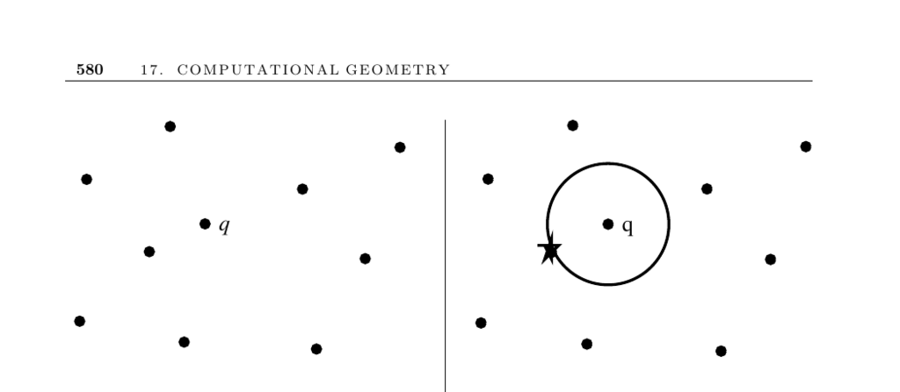

- **17.5 Nearest Neighbor Search**  
  - The problem identifies the closest point in a set S of n points in d dimensions to a query point q.  
  - Nearest neighbor search is critical in applications like emergency dispatch and classification tasks.  
  - kd-trees are effective for moderate dimension searches but degrade above 20 dimensions, where brute force may be preferable.  
  - Voronoi diagrams provide efficient nearest neighbor queries in two dimensions but become impractical in higher dimensions.  
  - Approximate methods include dimension reduction via random projections and randomized query perturbations to improve efficiency.  
  - Data structures and strategies differ based on whether the data set is static or dynamic, with kd-trees supporting insertions and deletions when needed.  
  - The nearest neighbor graph is a subgraph of the Delaunay triangulation and can be computed in O(n log n) time.  
  - The closest pair problem serves as a lower bound and is reducible to sorting in one dimension.  
  - Notable implementations include the ANN library ([ANN](http://www.cs.umd.edu/~mount/ANN/)), Samet’s kd-tree demos ([Samet](http://donar.umiacs.umd.edu/quadtree/)), and other specialized software such as Ranger and Nearpt3.  
  - Voronoi diagram libraries such as CGAL ([CGAL](https://www.cgal.org)) and LEDA implement planar nearest neighbor search efficiently.  
  - Key references include surveys on approximate nearest neighbor search by Indyk ([Ind04]), theory and empirical results on dimension reduction ([IM04], [BM01]), and algorithmic techniques by Samet ([Sam06], [Sam05]) and Pan ([Pan06]) for randomized search perturbations.  
  - Related problems and data structures include kd-trees (Section 12.6), Voronoi diagrams (Section 17.4), and range search (Section 17.6).
