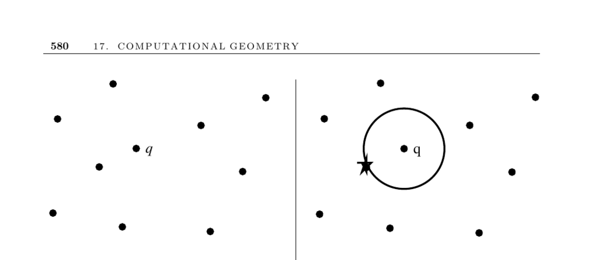

- **Nearest Neighbor Search**
  - **Problem description and applications**
    - Finds the closest point in a set S of n points in d dimensions to a query point q.
    - Applications include dispatching emergency vehicles, classification of labeled data points, and vector-quantization in image compression.
    - The problem arises in mapping customers to service providers and many geometric queries.
  - **Challenges and issues**
    - Searching complexity depends on the number of points and dimensions involved.
    - Kd-trees work well in moderate dimensions but degrade above about 20 dimensions.
    - Voronoi diagrams provide efficient planar nearest-neighbor queries but scale poorly in higher dimensions.
    - Exact nearest neighbor search is difficult in high dimensions; approximate methods and dimension reduction techniques can improve performance.
  - **Key considerations**
    - The choice of data structures should consider dataset size, dimensionality, exactness requirement, dynamic updates, and available computing time.
    - Random perturbations of the query point can improve approximate search results in kd-trees.
  - **Theoretical results and related concepts**
    - The nearest neighbor graph is a subgraph of the Delaunay triangulation, computable in O(n log n).
    - Closest pair detection reduces to sorting in one dimension with O(n log n) complexity.
  - **Implementations and tools**
    - ANN library supports exact and approximate search in high dimensions and multiple lp norms, available at [ANN](http://www.cs.umd.edu/~mount/ANN/).
    - Samet’s spatial index demos illustrate kd-tree variants and are accessible at [Samet Demos](http://donar.umiacs.umd.edu/quadtree/).
    - KDTREE 2 provides C++ and Fortran 95 implementations; see [KDTREE 2](http://arxiv.org/abs/physics/0408067).
    - Ranger tool supports visualization of multiple multidimensional search trees; available at [Ranger](http://www.cs.sunysb.edu/~algorith).
    - Nearpt3 focuses on very large 3D point sets; details at [Nearpt3](http://wrfranklin.org/Research/nearpt3).
    - CGAL and LEDA offer Voronoi diagram implementations and planar point location for nearest-neighbor queries.
  - **Notes and references**
    - Indyk surveys approximate nearest neighbor search using random projection methods [Ind04].
    - Ayra and Mount’s ANN method uses a sparse weighted graph and greedy walks for approximate neighbors [AM93, AMN+98].
    - Nearest neighbor search was a topic in the Fifth DIMACS challenge [GJM02].
    - Samet’s works provide comprehensive references on kd-trees and spatial data structures [Sam06], plus a shorter survey [Sam05].
    - Random query point perturbation technique is credited to [Pan06].
    - Classic divide-and-conquer closest pair algorithms are referenced in [BS76], [CLRS01], and [Man89].
