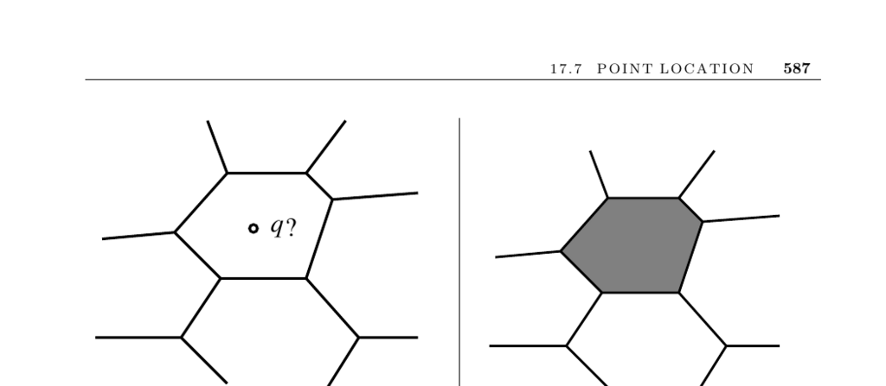

- **Point Location Problem**
  - **Input and Output**
    - The problem involves a planar subdivision into polygonal regions and a query point q.
    - The goal is to identify which region contains the query point.
    - Variations include determining whether a point lies inside or outside a polygon.
  - **Inside-Outside Tests**
    - Ray casting counts polygon edge crossings to decide if a point lies inside a polygon.
    - Testing each of n edges takes O(n) time; convex polygons allow binary search in O(lg n).
    - Triangulating polygonal regions reduces inside-outside tests to point-in-triangle tests.
  - **Subdivision and Query Efficiency**
    - Performing repeated queries on the same subdivision merits data structures for fast lookups.
    - Grid-like or tree-like structures help find the correct region quickly.
    - Triangulations improve performance by creating smaller, simpler regions.
  - **Grid Files and Regularity of Regions**
    - Grid files overlay a k×k grid to store region lists per rectangle for fast location queries.
    - Performance depends on region shape regularity and the overlap between regions and rectangles.
    - Irregular spacing of grid lines can improve flexibility.
    - The slab method uses horizontal lines through vertices to create slabs and uses binary search for queries with O(n^2) space in the worst case.
  - **Kd-Trees for Point Location**
    - Kd-trees decompose space hierarchically into rectangular boxes recursively.
    - Point location starts at the root and traverses child boxes containing q until a leaf is reached.
    - Leaves contain a small set of regions, minimizing search time.
    - Kd-trees are preferred for higher dimensions and irregular planar subdivisions.
  - **Walking Technique**
    - Starts from an arbitrary point in a cell to move towards the query point by ray shooting.
    - Expected path length is O(n^{1/d}) in d dimensions, but worst-case linear.
    - Ray shooting queries in triangulated arrangements take constant time.
  - **Slab Method**
    - Splits the plane into n+1 horizontal slabs between vertex lines.
    - Binary searches on y-coordinates identify slab and edge crossings for queries.
    - Requires O(n^2) space, but guarantees O(lg n) worst-case search time.
  - **Implementation and Software**
    - CGAL and LEDA provide C++ libraries supporting planar subdivisions and point location.
    - CGAL implements jump-and-walk and worst-case logarithmic search.
    - LEDA provides expected O(lg n) point location using partially persistent search trees.
    - ANN library supports nearest-neighbor searching, useful for walking start points.
    - Arrange package supports polygon arrangements and efficient point location with randomized incremental algorithms.
  - **Surveys and Research**
    - Snoeyink [Sno04] surveys theory and practice in point location.
    - Kirkpatrick’s triangle refinement method builds a hierarchy of triangulations for linear space and O(lg n) query time.
    - Slab method is due to [DL76] and analyzed in [PS85].
    - Dynamic data structures for point location with updates are surveyed in [CT92].
    - Further reading includes O’Rourke, Preparata and Shamos, and Tamassia and Vismara ([TV01]) for algorithm engineering and experimental evaluations.
