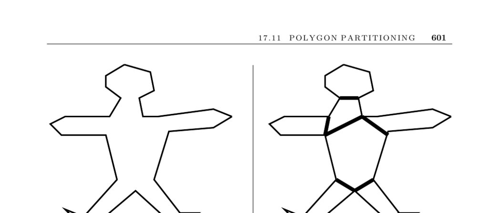

- **Polygon Partitioning**
  - **Problem Description**
    - The problem is to partition a polygon or polyhedron into a small number of simple, typically convex, pieces.
    - Polygon partitioning simplifies many geometric algorithms by working with convex parts instead of nonconvex objects.
    - Triangulation partitions a polygon into exactly n − 2 triangles but may not minimize the number of convex pieces.
    - See Section 17.3 for a thorough discussion of triangulation.
  - **Partitioning Variants**
    - Partitioning divides the polygon into nonoverlapping pieces, while covering allows overlapping pieces.
    - Partitioning ensures each point inside the polygon belongs to exactly one piece, useful for range searching.
    - Covering can be useful for applications such as painting, where overlaps are acceptable.
    - Allowing Steiner vertices (new points) may reduce the number of pieces but increases algorithmic complexity.
  - **Algorithms and Heuristics**
    - The Hertel-Mehlhorn heuristic starts with any triangulation and deletes chords that preserve convexity.
    - This heuristic guarantees a partition with no more than four times the minimum number of convex pieces.
    - Dynamic programming can find the minimum number of diagonals in O(n^4) time.
    - More advanced algorithms run in O(n + r^2 min(r^2, n)) or O(n^3) time, some allowing interior Steiner points.
  - **Monotone Partitioning**
    - A y-monotone polygon can be decomposed into two chains where horizontal lines intersect each chain once.
    - Many triangulation methods begin by finding trapezoidal or monotone decompositions.
    - Triangulation is a special case of convex decomposition.
  - **Implementations**
    - CGAL provides a polygon-partitioning library with implementations of the Hertel-Mehlhorn heuristic, optimal convex partitioning, and a sweepline heuristic for monotone polygons.
    - GEOMPACK offers Fortran 77 codes for 2D and 3D triangulation and convex decomposition.
  - **Notes and References**
    - Surveys by Keil [Kei00], O’Rourke and Suri [OS04], and Keil and Sack [KS85] cover polygon partitioning.
    - Hertel-Mehlhorn heuristic is detailed by Hertel and Mehlhorn [HM83] and O’Rourke [O’R01].
    - The dynamic programming algorithm by Keil and Snoeyink [KS02] and convex decomposition with Steiner points by Chazelle and Dobkin [CD85] are seminal results.
    - Lien and Amato [LA06] extend heuristics to polygons with holes and polyhedra.
    - Art gallery problems relate to covering polygons with star-shaped pieces and are discussed by O’Rourke [O’R87].
