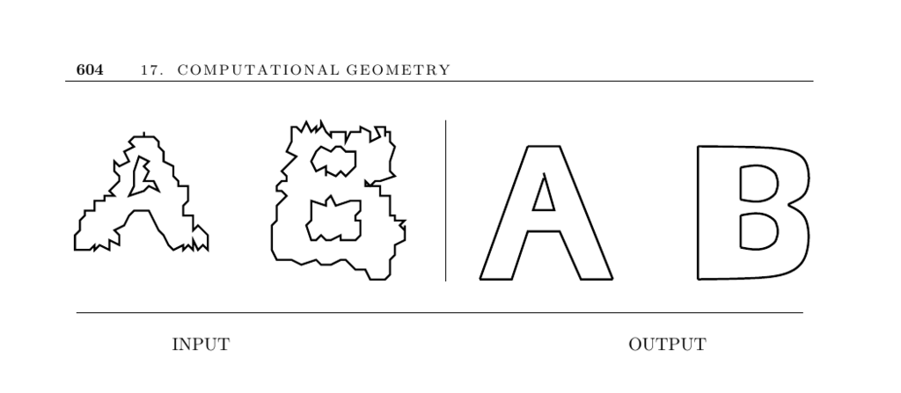

- **Simplifying Polygons**
  - **Problem Statement**
    - The goal is to find a polygon or polyhedron with fewer vertices that closely approximates the original shape.
    - Simplification can serve to remove noise from scanned shapes or to compress data for faster rendering in graphics.
  - **Key Issues in Shape Simplification**
    - Convex hull simplification removes concavities but may erase important shape features.
    - Simplification methods vary in whether they delete or also move vertices, affecting shape fidelity.
    - Maintaining a simple polygon without self-intersections is crucial for some applications.
    - Cleaning noisy images often involves frequency filtering techniques like the Fourier transform.
  - **Douglas-Peucker Algorithm**
    - The algorithm iteratively inserts vertices that maximize shape fidelity and operates in O(kn) time.
    - It starts with a simple approximating polygon and refines it by adding points based on maximum deviation.
    - An implementation with efficient worst-case performance is available from Snoeyink [HS94](http://www.cs.unc.edu/~snoeyink/papers/DPsimp.arch).
  - **Advanced Approaches and Implementations**
    - Simplification envelopes automate level-of-detail creation and prevent self-intersections ([source](http://www.cs.unc.edu/~geom/envelope.html)).
    - QSlim uses quadric error metrics for fast, high-quality triangulated surface simplification ([source](http://graphics.cs.uiuc.edu/~garland/software.html)).
    - Medial-axis transform simplifications produce skeletons used to trim and reconstruct simpler polygons and polyhedra.
    - Tools like Cocone and Powercrust build approximations of medial axes for surface reconstruction in 3D.
    - CGAL supports extreme polygon/polyhedron simplifications like smallest enclosing circle/sphere computations.
  - **Computational Complexity and Notes**
    - Simplification in three dimensions is NP-complete for minimal surfaces between polyhedra.
    - Faster shape simplification algorithms build on Douglas-Peucker and link distance approaches.
    - Testing polygon simplicity can be done in linear time using triangulation algorithms like Chazelle’s.
    - For further details, consult surveys on shape simplification by Heckbert and Garland [HG97].
