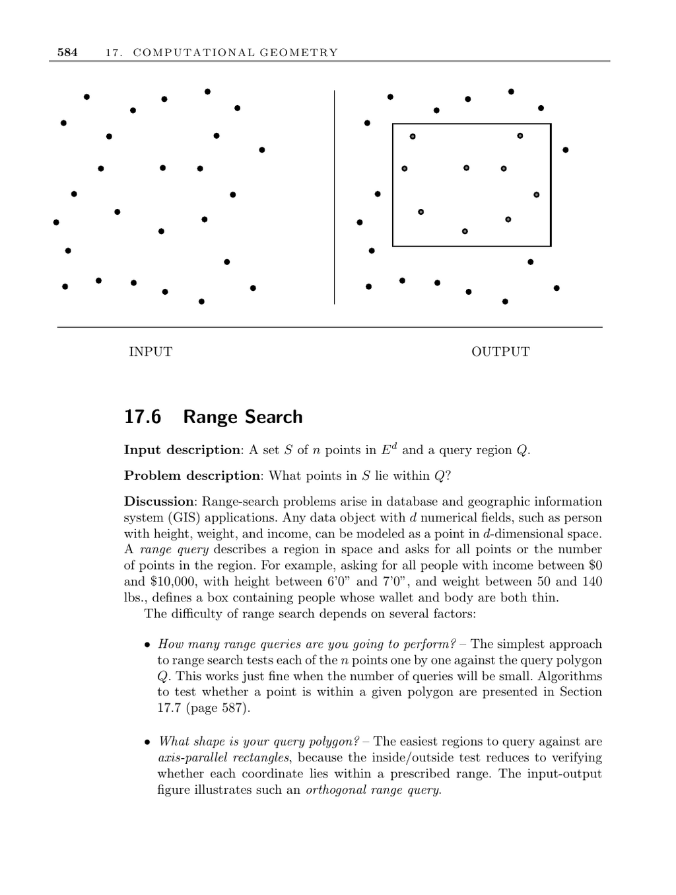

- **17.6 Range Search**
  - **Input description**
    - Input consists of a set S of n points in d-dimensional Euclidean space and a query region Q.
    - The problem is to identify which points in S lie within Q.
  - **Problem description**
    - Range-search problems occur in database and geographic information system (GIS) applications.
    - Data with d numerical fields is modeled as points in d-dimensional space.
    - Range queries specify a region and ask for all points or their count inside it.
  - **Discussion of difficulty factors**
    - The number of queries impacts the approach; testing points individually is viable for few queries.
    - Query polygon shape matters; axis-aligned rectangles simplify inside/outside tests.
    - Partitioning nonconvex polygons into convex pieces simplifies evaluation.
    - The dimensionality influences method selection; kd-trees are effective for multiple dimensions.
    - Static or dynamic point sets affect the suitability of data structures, with Delaunay triangulations supporting dynamic updates.
    - Queries can request counts rather than point sets, enabling efficient counting methods.
  - **Data structures and algorithms**
    - kd-trees enable depth-first traversal based on rectangle intersection with query regions.
    - Delaunay triangulations facilitate dynamic insertion/deletion and efficient range queries through planar point location.
    - Dominance ordering supports aggregate range queries by counting dominated points.
    - Precomputing dominance counts in space partitions allows O(log n) query time but uses quadratic space.
    - kd-tree adaptations reduce space complexity while retaining query efficiency.
  - **Implementations**
    - CGAL and LEDA provide dynamic Delaunay triangulation and range tree implementations supporting circular, triangular, and orthogonal queries.
    - Range trees achieve O(k + log² n) time for orthogonal queries, where k is output size.
    - ANN library delivers exact and approximate nearest neighbor searches in up to 20 dimensions.
    - Ranger visualizes and experiments with high-dimensional nearest-neighbor and orthogonal-range queries, supporting multiple search structures and Minkowski metrics.
  - **Notes and references**
    - Worst-case O(log n + k) performance data structures exist for orthogonal range queries ([Wil85], [dBvKOS00], [PS85]).
    - kd-trees may have poor worst-case performance demonstrated in two-dimensional examples ([LW77]).
    - Nonorthogonal queries, such as half-plane and simplex queries, are more complex; half-plane queries can be answered in O(log n) time with linear space, but simplex queries face lower bound limitations.
    - Agrawal [Aga04] provides a survey on range searching complexities.
  - **Related problems**
    - kd-trees as discussed on page 389.
    - Point location methods described on page 587.
