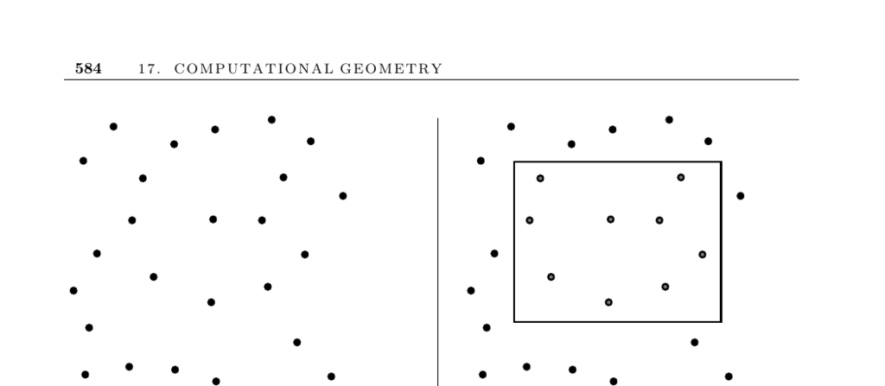

- **17.6 Range Search**
  - **Input and Problem Description**
    - The problem involves identifying points in a set S of n points in E^d that lie within a query region Q.
    - Range-search problems arise in database and geographic information systems (GIS) applications.
    - Data objects with d numerical fields, like height, weight, and income, can be modeled as points in d-dimensional space.
    - A range query returns all points or the number of points inside a defined spatial region.
  - **Factors Influencing Range Search Difficulty**
    - The number of range queries impacts the choice of method; testing all points individually suffices for few queries.
    - The shape of the query polygon matters; axis-parallel rectangles enable simpler inside/outside tests via coordinate ranges.
    - Nonconvex polygons require partitioning into convex pieces or triangles for efficient point-in-polygon testing.
    - The number of dimensions affects approach; kd-trees offer efficient, practical solutions especially in the plane and higher dimensions.
    - Static versus dynamic point sets influence strategy; dynamic sets benefit from Delaunay triangulation methods supporting insertions/deletions.
    - Whether counting points or identifying them changes requirements; dominance ordering and related data structures enable efficient counting.
  - **Approaches and Data Structures**
    - kd-trees enable depth-first search restricted to nodes intersecting Q, with efficient typical but potentially poor worst-case performance.
    - Delaunay triangulations support dynamic sets, using planar point location and depth-first search with pruning for efficient queries.
    - Dominance counting uses precomputed counts over n² rectangles formed by horizontal and vertical lines through points, allowing O(log n) queries at quadratic space cost.
    - kd-tree adaptations reduce space requirements while supporting dominance queries.
  - **Implementations**
    - CGAL and LEDA libraries provide dynamic Delaunay triangulations and range tree data structures for orthogonal and other range queries.
    - ANN C++ library supports exact and approximate nearest neighbor searches in high dimensions with various distance norms.
    - Ranger tool supports visualization and experimentation with nearest neighbor and orthogonal range queries using multiple search structures.
  - **Notes and Theoretical Results**
    - Worst-case efficient orthogonal-range data structures exist with O(log n + k) query time and are detailed in referenced works [Wil85, dBvKOS00, PS85].
    - kd-trees may perform poorly in worst cases, with lower bounds showing Ω(√n) reporting time for empty rectangles.
    - Nonorthogonal queries, such as half-plane or simplex queries, are more challenging, with known complexity limitations [CGL85, Aga04].
  - **Related Problems**
    - Related topics include kd-trees (page 389) and point location (page 587).
