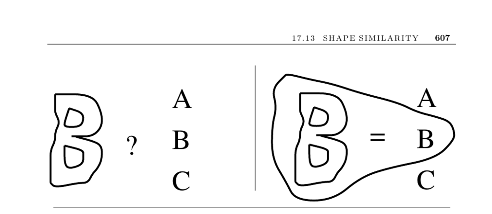

- **Shape Similarity**
  - **Input Description**
    - The input consists of two polygonal shapes, labeled P1 and P2.  
  - **Problem Description**
    - The problem asks how similar the two polygons P1 and P2 are.  
    - Shape similarity is fundamental to pattern recognition tasks such as optical character recognition (OCR).  
  - **Discussion**
    - Shape similarity is application-dependent and inherently ill-defined, requiring tailored algorithms and extensive tuning.  
    - Hamming distance measures the symmetric difference area between two aligned polygons, requiring polygon intersection and union computations.  
    - Proper alignment is challenging and often simplified in applications like OCR by using reference landmarks or restricting rotations.  
    - Hausdorff distance measures the greatest minimum distance from points on one polygon to the other and is sensitive to protrusions but robust to boundary noise.  
    - Comparing skeletons uses thinning to reduce shapes to tree-like graphs and compares topology and edge features via subgraph isomorphism.  
    - Support Vector Machines (SVMs) utilize feature extraction and training data to classify shapes, requiring large datasets and tuning to perform well.  
    - Black-box classifiers like SVMs may fail unpredictably if the decision rationale is unknown, illustrated by a military image classification example.  
  - **Implementations**
    - A Hausdorff distance image comparison implementation in C is available at [Cornell Hausdorff](http://www.cs.cornell.edu/vision/hausdorff/hausmatch.html).  
    - Angle-turning function-based distance metrics have C implementations by Eugene K. Ressler at [Stony Brook Algorithms](http://www.cs.sunysb.edu/~algorith).  
    - Several SVM libraries exist, including Kernel-Machine Library, SVMlight, and LIBSVM.  
  - **Notes**
    - General pattern classification references include [DHS00] and [JD88].  
    - Various computational geometry approaches are summarized in surveys by Alt and Guibas [AG00] and others.  
    - Optimal alignment of convex polygons under translation is computable in O((n + m) log(n + m)) time [dBDK+98].  
    - Linear-time algorithms for Hausdorff distance between convex polygons exist [Ata83], with general algorithms in [HK90].  
  - **Related Problems**
    - Graph isomorphism relates to skeleton-based shape comparison.  
    - Thinning assists in extracting skeletons from polygonal shapes.
