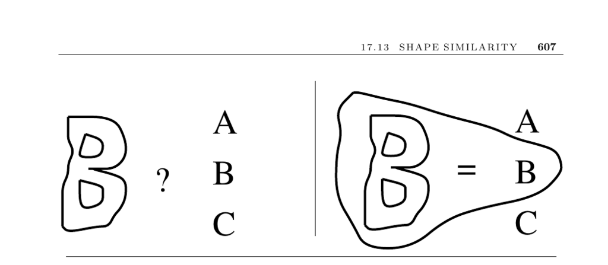

- **Shape Similarity**
  - **Input Description**
    - The input consists of two polygonal shapes, labeled P1 and P2.
    - These polygons serve as the basis for assessing similarity.
  - **Problem Description**
    - The goal is to determine how similar polygons P1 and P2 are.
    - The concept of similarity is inherently application dependent and ill-defined.
  - **Discussion**
    - Shape similarity is fundamental in pattern recognition and optical character recognition (OCR).
    - No single algorithm solves all shape-matching problems due to varying definitions of similarity.
    - Alignment of polygons is a critical and difficult component of similarity measurement.
  - **Approaches to Shape Similarity**
    - **Hamming Distance**
      - Measures the area of symmetric difference between two overlaid polygons.
      - Efficient on bit-mapped images but captures only a crude notion of shape.
      - Alignment heuristics include matching centroids, bounding boxes, or extremal vertices.
      - Requires computing polygon intersections or unions and areas.
    - **Hausdorff Distance**
      - Measures the maximum distance from a point in P1 to the closest point in P2.
      - Not symmetrical; thin protrusions can disproportionately affect the distance.
      - More robust to boundary noise than Hamming distance.
      - Computing alignments is also challenging and time-consuming.
    - **Comparing Skeletons**
      - Uses thinning to extract tree-like skeletons from shapes.
      - Compares topology and edge properties of skeletons, modeled as subgraph isomorphism.
    - **Support Vector Machines (SVM)**
      - Uses learned classifiers to recognize and match shapes based on computed features.
      - Useful when abundant training data is available without clear heuristic methods.
      - Requires careful tuning and carries risk of misclassification due to lack of interpretability.
  - **Implementations**
    - A Hausdorff-based image comparison implementation is available at Cornell’s vision group website.
    - Turning function metric implementation in C by Eugene K. Ressler is accessible online.
    - Widely used SVM libraries include kernal-machine library, SVMlight, and LIBSVM.
  - **Notes**
    - Comprehensive pattern classification resources include [DHS00, JD88].
    - Many computational geometry techniques have been proposed; see the survey by Alt and Guibas [AG00].
    - Optimal alignment algorithms for convex polygons run in O((n + m) log(n + m)) time.
    - Linear-time algorithms exist for Hausdorff distance on convex polygons.
  - **Related Problems**
    - Graph isomorphism, relevant for skeleton comparison.
    - Thinning techniques for skeleton extraction.
