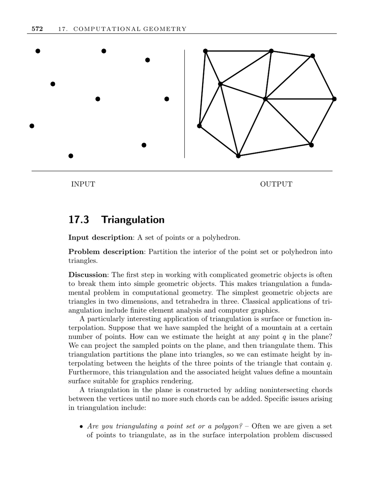

- **17.3 Triangulation**
  - The section addresses partitioning a point set or polyhedron interior into triangles or tetrahedra.
  - Triangulation facilitates working with complex geometric objects by decomposing them into simpler shapes.
  - Delaunay triangulation is preferred due to angle maximization properties and duality to Voronoi diagrams.
  - Various algorithms exist, including an O(n log n) method based on sorting points and convex hull construction.
  - Applications include surface interpolation, finite element analysis, and computer graphics.
  - Local improvement techniques use edge flips to enhance triangulation quality by reducing skinny triangles.
  - Three-dimensional triangulations are more complex, sometimes requiring additional Steiner points and facing NP-completeness issues.
  - Constrained triangulations respect input polygon or polyhedron boundaries and obstacles.
  - External software resources include [Triangle](http://www.cs.cmu.edu/~quake/triangle.html), Fortune’s Sweep2 from Netlib, [Meshing Research Corner](http://www.andrew.cmu.edu/user/sowen/mesh.html), QMG, [CGAL](https://www.cgal.org), LEDA, and [Qhull](http://www.qhull.org).
  - Key theoretical results include Chazelle’s linear-time polygon triangulation algorithm and NP-completeness of minimum weight triangulation.
  - The section references surveys by Bern ([Ber04a]) and overviews of mesh generation ([Ber02], [Ede06]).
  - Related topics are Voronoi diagrams and polygon partitioning covered elsewhere.
