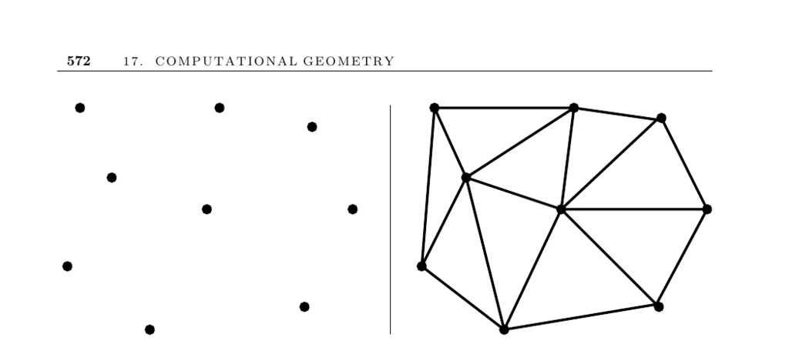

- **Triangulation**
  - **Input and Problem Description**
    - Triangulation involves partitioning the interior of a point set or polyhedron into triangles.
    - It is fundamental for simplifying complicated geometric objects in computational geometry.
    - Classical applications include finite element analysis and computer graphics.
  - **Surface or Function Interpolation**
    - Triangulating sampled points on a plane enables height estimation by interpolation within covering triangles.
    - Resulting triangulation and heights define a surface suitable for graphics rendering.
    - Useful for estimating unknown values based on sampled data points.
  - **Construction of Triangulations**
    - Triangulation in the plane is done by adding nonintersecting chords between vertices until no more can be added.
    - The process depends on whether the input is a point set or polygon.
    - The convex hull is a starting point for triangulating point sets.
    - Sorting points by x-coordinate enables an O(n log n) triangulation via incremental insertion.
  - **Triangle Shape Considerations**
    - Different triangulations exist for the same input, impacting triangle shape quality.
    - Minimizing skinny triangles (small angles) is often desirable.
    - Delaunay triangulation minimizes the maximum angle and has duality with the Voronoi diagram.
    - Delaunay triangulation can be constructed in O(n log n) time.
  - **Improving a Given Triangulation**
    - Internal edges shared by two triangles can be replaced by swapping chords within convex quadrilaterals ("edge-flip").
    - Edge-flips improve triangulation quality by removing skinny triangles.
    - Any triangulation can be transformed into a Delaunay triangulation through edge-flips.
  - **Dimensionality Issues**
    - Three-dimensional triangulation generalizes to tetrahedralization.
    - Some polyhedra require adding extra vertices for tetrahedralization.
    - Deciding tetrahedralizability without added vertices is NP-complete.
  - **Constraints on Inputs**
    - Triangulating polygons or polyhedra restricts chord insertion to avoid intersecting boundary edges or obstacles.
    - Constrained Delaunay triangulation respects such constraints.
  - **Adding Extra Points**
    - Steiner points can be strategically inserted to improve triangle quality or achieve tetrahedralization.
    - Adding extra points helps avoid small angles and enables triangulation where none exists otherwise.
  - **Algorithms and Complexity**
    - Convex polygon triangulation can be done in linear time by connecting one vertex to all others.
    - General polygon triangulation algorithms have time complexities from O(n log n) to linear time for special cases.
    - Checking all possible chords yields an O(n²) naive approach.
  - **Implementations**
    - The Triangle program by Jonathan Shewchuk generates various Delaunay triangulations reliably and efficiently.
    - Fortune’s Sweep2 algorithm computes Voronoi diagrams and Delaunay triangulations via a sweepline approach.
    - Mesh generation is a large field; resources include Steve Owen’s Meshing Research Corner and QMG software.
    - CGAL and LEDA libraries provide extensive C++ implementations for triangulations including constrained versions.
    - Qhull software handles convex hulls and Delaunay triangulations up to around eight dimensions.
    - Ken Clarkson’s Hull is another higher-dimensional convex hull and triangulation code.
  - **Notes and Theoretical Results**
    - A linear-time polygon triangulation algorithm by Chazelle is primarily theoretical and difficult to implement.
    - The first O(n log n) polygon triangulation algorithm was by Garey et al.
    - Linear-time algorithms exist for triangulating monotone polygons, used for simple polygon triangulations.
    - Minimum weight triangulation is NP-complete; approximation algorithms are studied.
    - Minimum weight triangulation for convex polygons can be computed in O(n³) with dynamic programming.
  - **Related Problems**
    - Voronoi diagrams and polygon partitioning are closely related computational geometry problems.
    - For detailed mesh generation literature see [Meshing Research Corner](http://www.andrew.cmu.edu/user/sowen/mesh.html) and [QMG](http://www.cs.cornell.edu/Info/People/vavasis/qmg-home.html).
