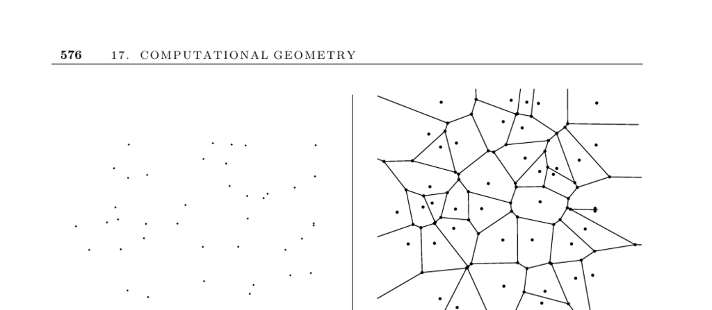

- **Voronoi Diagrams**
  - **Input and Problem Description**
    - Input consists of a set S of points \( p_1, \ldots, p_n \).
    - The problem is to partition space into regions where each region contains points closest to a specific \( p_i \) than any other point in S.
    - Voronoi diagrams represent the region of influence around each given site.
  - **Applications**
    - Nearest neighbor search is performed by locating the Voronoi cell containing a query point.
    - Facility location problems use Voronoi vertices to position new sites that maximize distance from existing ones.
    - Largest empty circle centers correspond to Voronoi vertices, useful for locating large undeveloped areas.
    - Path planning leverages edges of Voronoi diagrams to maximize distance from obstacles.
    - Quality triangulations arise by using the Delaunay triangulation, the Voronoi diagram’s dual, which maximizes minimum angles.
  - **Construction Methods**
    - Each Voronoi edge is part of the perpendicular bisector between two points in S.
    - Randomized incremental construction adds sites in random order, affecting few regions per insertion.
    - Fortune’s sweepline algorithm constructs diagrams in optimal \( \Theta(n \log n) \) time with a reasonable implementation complexity.
    - Construction relates to convex hulls in \(d+1\) dimensions via projection, aiding higher-dimensional diagrams.
  - **Variations**
    - Non-Euclidean metrics adjust Voronoi diagrams to consider factors like road networks and travel time.
    - Power diagrams assign differing influence powers to sites, modeling scenarios like radio station coverage.
    - \(k\)th-order and furthest-site diagrams partition space by sets of \(k\) closest or furthest points.
  - **Implementations**
    - Fortune’s Sweep2 is a popular C implementation for 2D Voronoi diagrams.
    - The CGAL and LEDA libraries offer C++ tools for 2D and 3D diagrams and triangulations.
    - Higher-dimensional diagrams can be constructed using convex hull software like Qhull and Hull.
    - Qhull handles dimensions up to about eight and constructs Delaunay triangulations, Voronoi vertices, and related structures.
  - **Historical Notes and References**
    - Voronoi diagrams, also called Dirichlet tessellations, were first studied by Dirichlet (1850) and later by Voronoi (1908).
    - Early \( O(n \log n) \) algorithms by Shamos and Hoey use divide-and-conquer.
    - Fortuna’s sweepline algorithm and the convex hull connection with Delaunay triangulations are well documented.
    - Complete treatments and surveys include works by Okabi et al., Aurenhammer, Fortune, and others.
    - \(k\)th-order diagrams can be constructed in \( O(n^3) \) time, with point location enabling \(k\)-nearest neighbor queries efficiently.
    - The smallest enclosing circle problem relates to high-order Voronoi diagrams and has linear-time solutions based on low-dimensional linear programming.
    - Relevant external resources: [Fortune’s sweepline algorithm](http://www.netlib.org/voronoi/), [Qhull](http://www.qhull.org/), [CGAL](https://www.cgal.org), [Aurenhammer survey](https://doi.org/10.1007/3-540-09489-9_4).
