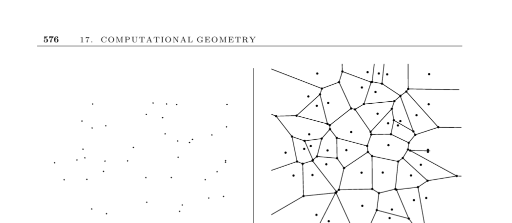

- **17.4 Voronoi Diagrams**
  - **Input description**
    - The input consists of a set S of points p1, ..., pn.
    - The Voronoi diagram partitions space into regions closer to each point pi than any other point in S.
    - This concept defines regions of influence around each site in the set.
    - See Section 17.5 for nearest neighbor search related to Voronoi diagrams.
  - **Applications of Voronoi Diagrams**
    - Voronoi diagrams support nearest neighbor search by locating query points within cells.
    - Facility location problems use Voronoi vertices to place new sites farthest from existing ones.
    - The largest empty circle centered at a Voronoi vertex identifies maximum empty regions.
    - Path planning leverages Voronoi edges to maximize clearance from obstacles.
    - Quality triangulations, specifically Delaunay triangulations, are duals of Voronoi diagrams and maximize minimum angles.
  - **Construction Methods**
    - Each Voronoi edge is a segment of a perpendicular bisector between two points.
    - Randomized incremental construction adds sites sequentially, updating impacted regions.
    - Fortune’s sweepline algorithm runs in optimal Θ(n log n) time and is considered the method of choice.
    - Fortune’s algorithm projects sites into 3D cones and then back to 2D for diagram construction.
  - **Higher-Dimensional Voronoi Diagrams**
    - There is a relation between convex hulls in d+1 dimensions and Delaunay triangulations in d dimensions.
    - Constructing higher-dimensional Voronoi diagrams involves projecting points into d+1 dimensions and computing convex hulls.
    - Section 17.2 discusses algorithms for higher-dimensional convex hulls.
  - **Variations and Extensions**
    - Voronoi diagrams can be constructed under non-Euclidean distance metrics for specialized applications.
    - Power diagrams generalize Voronoi diagrams by incorporating varied site influences such as transmitter power.
    - Kth-order Voronoi diagrams partition space by sets of k closest points; furthest-site diagrams identify regions with the same farthest point.
    - Point location queries on these structures allow efficient retrieval of relevant sites.
  - **Implementations**
    - Fortune’s Sweep2 is a widely used C implementation of Fortune’s algorithm available at Netlib.
    - CGAL and LEDA libraries provide C++ implementations for 2D and 3D Voronoi diagrams and Delaunay triangulations.
    - Qhull, a C-based convex hull code, supports up to about eight dimensions and can compute Voronoi vertices and related structures.
    - Ken Clarkson’s Hull code is another tool for higher-dimensional convex hull computations.
  - **Historical Notes and References**
    - Voronoi diagrams were first studied by Dirichlet in 1850 and named after Georgy Voronoi’s 1908 work.
    - The first O(n log n) algorithm was by Shamos and Hoey (divide-and-conquer).
    - Fortune’s sweepline algorithm and the relationship between Delaunay triangulations and convex hulls are well-explained in [dBvKOS00, O’R01].
    - Kth-order Voronoi diagrams have O(n^3) construction time using [ES86], with nearest neighbor queries executed in O(k + log n).
    - Linear-time algorithms exist for smallest enclosing circle and convex polygon Voronoi diagrams ([Meg83], [AGSS89]).
    - Additional comprehensive treatments are found in [OBSC00], [Aur91], and [For04].
