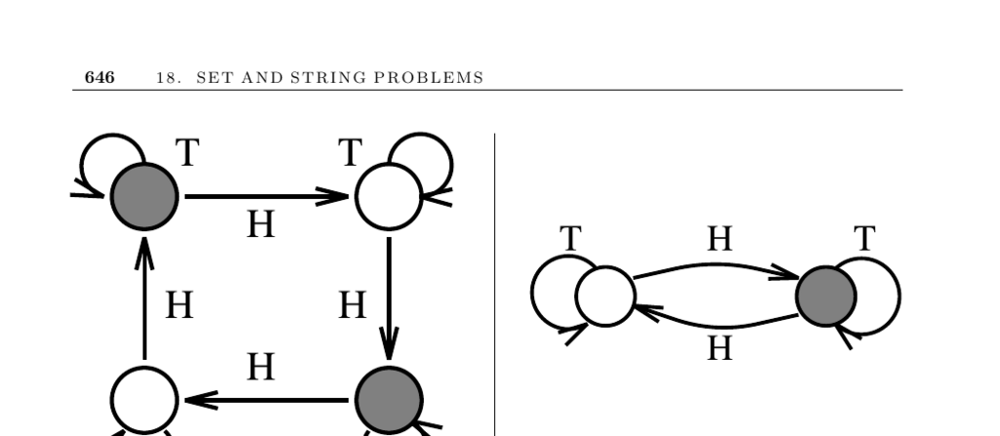

- **18.7 Finite State Machine Minimization**
  - **Minimizing deterministic finite state machines**
    - The goal is to create the smallest deterministic finite automaton (DFA) equivalent to a given DFA by eliminating redundant states.  
    - The minimization algorithm partitions states into equivalence classes and iteratively refines them until stable, yielding an O(n²) time complexity.  
    - A more efficient O(n log n) algorithm for DFA minimization is known, such as Hopcroft’s algorithm.  
    - Minimization reduces storage and execution costs in software and hardware applications.  
    - Refer to Grail+ ([link](http://www.csd.uwo.ca/Research/grail)) and the AT&T FSM Library ([link](http://www.research.att.com/~fsmtools/fsm/)) for implementations.  

  - **Constructing deterministic machines from nondeterministic machines**
    - Nondeterministic finite automata (NFAs) can be converted mechanically to equivalent DFAs, though this may cause exponential state blowup.  
    - The DFA resulting from NFA conversion can then be minimized to reduce size and complexity.  
    - Minimization problems for NFAs are PSPACE-hard, making them computationally intensive.  
    - Equivalence proofs between NFAs, DFAs, and regular expressions underpin these conversions.  
    - Tools such as JFLAP ([link](http://www.jflap.org/)) support these conversions and minimizations.  

  - **Constructing machines from regular expressions**
    - Regular expressions can be translated into equivalent finite automata by either constructing NFAs with ε-moves or building DFAs via the derivatives method.  
    - NFAs with ε-moves are simpler to construct, feature O(m) states for expressions of length m, and simulate in O(mn) time over strings of length n.  
    - The derivatives method constructs DFAs state-by-state but can require up to O(2^m) states in the worst case, leading to exponential space usage.  
    - Simulating input strings on a DFA is linear in time regardless of automaton size, which balances the space cost.  
    - Theoretical foundations include Thompson’s construction and Brzozowski’s derivatives method, with further material available in [Aho90], [HMU06], and [Sip05].  

  - **Implementations and related resources**
    - Grail+ offers C++ tools for conversion and minimization of finite automata with support for large alphabets.  
    - The AT&T FSM Library provides UNIX tools for handling very large automata and transducers.  
    - JFLAP offers graphical tools for education and conversion among automata and regular expressions.  
    - FIRE Engine implements production-quality finite automaton algorithms including Hopcroft’s minimization.  
    - The CIAA conference is the major annual event covering automata theory and software implementations ([link](http://tln.li.univ-tours.fr/ciaa/)).
