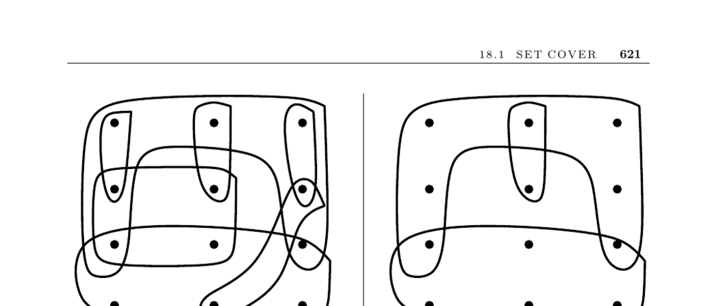

- **Set Cover**
  - **Input Description**
    - The input consists of a collection of subsets \( S = \{S_1, \ldots, S_m\} \) of the universal set \( U = \{1, \ldots, n\} \).
    - The goal is to find the smallest subset \( T \subseteq S \) whose union covers all elements of \( U \).
  - **Problem Description and Applications**
    - Set cover arises in acquiring items packaged in fixed lots while minimizing purchase quantity.
    - It models problems like Lotto ticket optimization and Boolean logic minimization via disjunctive normal form simplification.
    - Boolean functions can be implemented more efficiently by factoring common subsets, which reduces to set cover.
  - **Variations of Set Cover**
    - Elements may be allowed to be covered multiple times or just once; set cover differs from set packing based on this.
    - When subsets correspond to graph edges or vertices, set cover relates to maximum matching and vertex cover problems.
    - Subsets with only two elements can be solved optimally via maximum matching, while three-element subsets make the problem NP-complete.
    - Hitting set problem is dual to set cover, interchanging the roles of elements and subsets.
    - See Figure 18.1 for an illustration of hitting set and its dual set cover transformation.
  - **Complexity and Approximations**
    - Set cover is NP-complete and generally harder than vertex cover.
    - Approximation algorithms exist but the best for set cover achieve \( \Theta(\log n) \) approximation factor.
    - Greedy heuristic selects the largest set covering the most uncovered elements repeatedly.
    - The greedy approach executes in \( O(S) \) time using efficient data structures where \( S = \sum |S_i| \).
    - Early selection of subsets containing unique elements improves coverage efficiency.
  - **Advanced Approaches and Implementations**
    - Simulated annealing can yield better results than the greedy heuristic.
    - Backtracking yields optimal solutions at greater computational cost.
    - Integer programming formulation uses binary variables \( s_i \) to represent selected sets subject to coverage constraints.
    - Linear programming relaxations enable efficient heuristics via rounding techniques.
    - Implementations must generally be done from scratch; references include [SDK83] and the SYMPHONY solver.
  - **Notes and Literature**
    - Classic survey on set cover in [BP76]; approximation and complexity surveys in [Pas97].
    - Computational studies on integer programming heuristics in [CFT99, CFT00].
    - Expositions on the greedy heuristic in [CLRS01, Hoc96].
    - Examples showing greedy can be as bad as \(\log n\) approximation appear in [Joh74, PS98].
    - It is provably hard to approximate set cover within a factor better than \((1 - o(1)) \ln n\) [Fei98].
  - **Related Problems**
    - Matching (page 498), vertex cover (page 530), and set packing (page 625).
