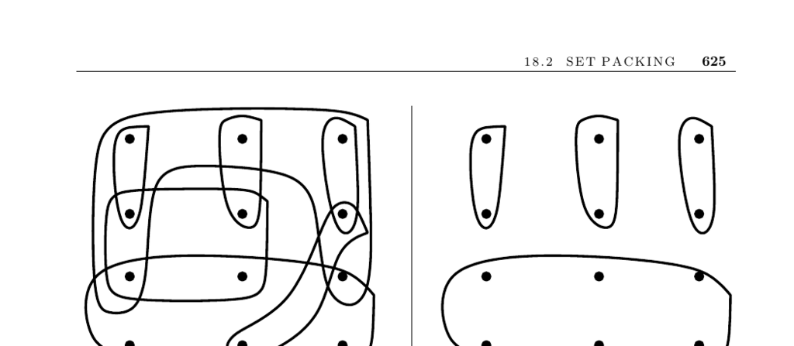

- **Set Packing**
  - **Input description**
    - The input consists of a set of subsets \( S = \{S_1, \ldots, S_m\} \) of a universal set \( U = \{1, \ldots, n\} \).
    - The goal is to select a collection of mutually disjoint subsets whose union is the universal set.
  - **Problem description**
    - The problem requires selecting subsets that do not overlap in their elements.
    - Applications include independent set problems on graphs and scheduling airline flight crews.
  - **Discussion**
    - Set packing problems arise where strict constraints prevent elements from being covered by more than one subset.
    - The independent set problem maps to a set packing problem with edges as universal elements.
    - The airplane scheduling problem models a perfect packing where each plane and crew member appear in exactly one subset.
    - The problem variants include exact cover, minimum-cardinality packing, and soft penalties for overlapping coverage.
    - The problem is NP-complete, often requiring exponential search or heuristics.
    - Relevant heuristics are greedy approaches similar to those used in set cover.
    - Integer programming formulation uses binary variables \( s_i \) that indicate subsets selected with a constraint ensuring each element is covered once.
  - **Implementations**
    - Set cover algorithms are more common but modifiable for set packing constraints.
    - Pascal implementations exist for exhaustive search and heuristics.
    - SYMPHONY solver supports set partitioning and is accessible at [http://branchandcut.org/SPP/](http://branchandcut.org/SPP/).
  - **Notes**
    - Survey articles include [BP76] and [Pas97].
    - Combinatorial auction bidding strategies reduce to set-packing problems ([dVV03]).
    - Relaxations for integer programs and algorithmic reductions are discussed in [BW00] and [SDK83].
  - **Related Problems**
    - Independent set problem (see Section 16.2).
    - Set cover problem (see Section 18.1).
