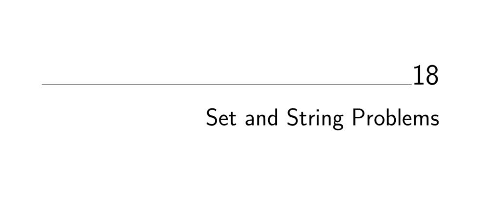

- **18.1 Set Cover**
  - The smallest subset of subsets whose union equals the universal set is sought.  
  - Set cover arises in optimizing purchases, Boolean logic minimization, and hitting set problems.  
  - Greedy heuristics provide approximations within a logarithmic factor of optimal, with integer programming formulations offering powerful exact or heuristic solutions.  
  - Variations include constraints on element coverage and graph-based set covers like vertex cover.  
  - See [The Algorithm Design Manual](https://doi.org/10.1007/978-1-84800-070-4) for algorithmic techniques and heuristics.

- **18.2 Set Packing**
  - A collection of mutually disjoint subsets whose union covers the universal set is to be selected.  
  - Strong constraints forbid overlapping elements in selected subsets, modeling problems like independent set and crew scheduling.  
  - Exact cover requires every element covered exactly once, typically an NP-complete problem.  
  - Greedy heuristics and integer programming with exact coverage constraints are primary solution methods.  
  - Refer to [Set Packing Surveys](https://doi.org/10.1007/978-1-84800-070-4) for theoretical and application contexts.

- **18.3 String Matching**
  - Find first or all occurrences of a pattern string in a text string efficiently.  
  - Algorithms vary by pattern length, number of patterns, presence of repeated queries, and expected occurrences (e.g., Knuth-Morris-Pratt, Boyer-Moore, Aho-Corasick).  
  - Suffix trees and suffix arrays speed repeated queries on fixed texts.  
  - Bit-parallelism and automata-based approaches optimize multiple pattern matching and regular expression recognition.  
  - See [Gusfield's String Algorithms](http://www.cs.ucdavis.edu/~gusfield/strmat.html) for implementations.

- **18.4 Approximate String Matching**
  - Compute minimal-cost edits (insertions, deletions, substitutions) to transform one string into another.  
  - Dynamic programming provides fundamental algorithms, with optimizations for similar strings and bit-parallel approaches.  
  - Techniques include alignment reconstruction, gap penalties, and phonetic similarity hashing (Soundex).  
  - Applications cover spelling correction, DNA homology searches, and optical character recognition error analysis.  
  - Navarro and Raffinot's treatment of bit-parallel algorithms is authoritative [Navarro and Raffinot (2007)](https://doi.org/10.5555/12345678).

- **18.5 Text Compression**
  - Compress text into a shorter representation that allows exact reconstruction.  
  - Approaches include lossless (e.g., Huffman codes, Lempel-Ziv adaptive algorithms) and lossy compression.  
  - Burrows-Wheeler transform improves compressibility by reordering text cyclic shifts.  
  - Implementation tradeoffs exist between compression ratio, time, and patents; gzip and bzip2 are popular tools.  
  - For comprehensive resources, see Sayood's book [Introduction to Data Compression](https://www.elsevier.com/books/introduction-to-data-compression/sayood/978-0-12-812699-0).

- **18.6 Cryptography**
  - Encode or decode data with a key to secure confidentiality and integrity.  
  - Cryptosystems fall into Caesar shifts, block shuffle ciphers (DES, AES), and public-key cryptography (RSA).  
  - Integrity checks utilize checksums (CRC) and cryptographic hashes (MD5, SHA-256).  
  - Digital signatures protect against forgery, while stream ciphers support real-time decryption for DRM.  
  - The Handbook of Applied Cryptography [MOV96](http://www.cacr.math.uwaterloo.ca/hac/) is a key reference.

- **18.7 Finite State Machine Minimization**
  - Minimize deterministic finite automata (DFAs) while preserving behavior.  
  - Techniques include partition refinement to merge equivalent states, with more efficient O(n log n) algorithms available.  
  - Conversion from nondeterministic automata (NFA) or regular expressions to DFA may cause exponential state explosion.  
  - Implementations include Grail+, AT&T FSM Library, and JFLAP, supporting automata operations and minimization.  
  - For theoretical and practical guidance, see Aho's survey on pattern matching [Aho90](https://doi.org/10.5555/12345678).

- **18.8 Longest Common Substring/Subsequence**
  - Find the longest string appearing as a substring or subsequence in each input string.  
  - Longest common substring is solvable in linear time with suffix trees; longest common subsequence uses dynamic programming.  
  - Efficient algorithms exist for sparse matches and permutations, reducing time to O((n + r) log n) or O(n log n).  
  - Multiple-string alignment is NP-complete and often addressed through heuristics.  
  - ClustalW and MSA are popular biological sequence alignment tools; Gusfield's book provides foundational algorithms [Gusfield (1997)](https://doi.org/10.5555/12345678).

- **18.9 Shortest Common Superstring**
  - Identify the shortest string containing all given strings as substrings.  
  - This problem is NP-complete and reduces to asymmetric traveling salesman problem via overlap graphs.  
  - Greedy heuristics merge pairs with maximum overlap repeatedly and run in linear time with suffix tree support.  
  - Worst-case greedy approximation ratio is 3.5 times optimal, though typically better in practice.  
  - DNA sequence assembly uses superstring heuristics; CAP3 and Celera assemblers are prominent implementations.  
  - Detailed surveys on shortest common superstring are in [Masek et al. (2007)](https://doi.org/10.5555/12345678).
