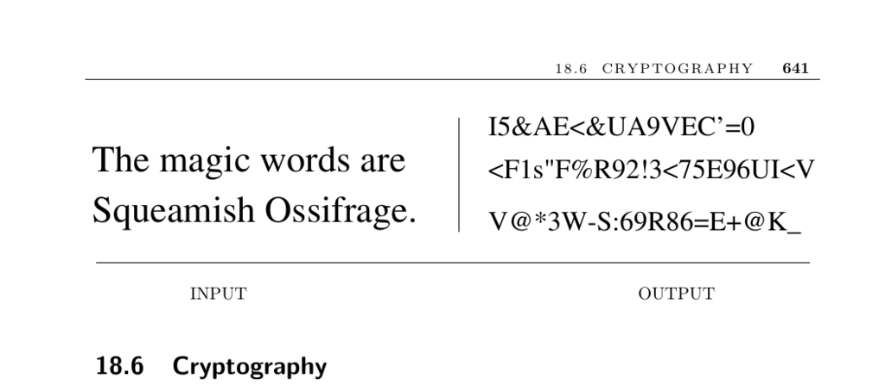

- **Cryptography Overview**
  - **Classes of Cryptosystems**
    - The three main types are Caesar shifts, Block Shuffle Ciphers, and Public Key Cryptography.
    - Caesar shifts are simple character rotations or permutations, vulnerable to frequency analysis.
    - Block Shuffle Ciphers manipulate bits in blocks and include DES and AES.
    - Public Key Cryptography uses different keys for encryption and decryption, solving key distribution issues.
    - For further detail, see [Cryptolounge Algorithm Category](http://www.cryptolounge.org/wiki/Category:Algorithm).
  - **Caesar Shifts**
    - These ciphers map each letter to another by fixed shifts or permutations.
    - They have limited key space (e.g., 26 keys for shifts, 26! for arbitrary permutations).
    - Frequency analysis commonly breaks these ciphers due to characteristic letter frequencies.
    - They are suitable only for low-security applications like hiding jokes.
    - Implementation examples exist in many educational cryptography programs.
  - **Block Shuffle Ciphers**
    - DES is the classic example, operating with 56-bit keys but now considered insecure.
    - Triple DES uses three rounds (encrypt-decrypt-encrypt) with two keys for increased security.
    - AES has replaced DES as the standard for strong encryption.
    - Triple DES remains approved for sensitive governmental use through 2030.
    - See [NIST Cryptographic Toolkit](http://csrc.nist.gov/groups/ST/toolkit) for standards.
  - **Public Key Cryptography**
    - Public key systems employ separate encryption and decryption keys, easing secure key distribution.
    - RSA is the classic example, relying on prime factorization difficulty.
    - RSA is significantly slower than symmetric ciphers but enables secure key exchange.
    - Recommended key size equivalences include 80-bit symmetric to 1024-bit asymmetric.
    - RSA resources available at [RSA Laboratories](http://www.rsa.com/rsalabs/).
  - **Selecting a Cryptosystem**
    - Security level depends on the adversary’s capability, from casual to government agencies.
    - Longer keys and algorithmic updates are vital due to advancing computational power.
    - User practices, such as strong passwords and secrecy, often outweigh algorithm choice in importance.
    - Use trusted, well-tested implementations like PGP or OpenSSL.
    - See [The Handbook of Applied Cryptography](http://www.cacr.math.uwaterloo.ca/hac/) for comprehensive guidance.
- **Integrity Validation Techniques**
  - **Detecting Random Corruption**
    - Checksums provide simple validation by summing character values mod a constant.
    - Checksums can fail with transposition errors due to commutativity.
    - Cyclic-redundancy checks (CRC) compute remainders of polynomial division to detect errors better.
    - CRCs are widely used in communication systems and storage validation.
    - Boost CRC Library offers multiple CRC implementations at [Boost CRC](http://www.boost.org/libs/crc/).
  - **Detecting Deliberate Corruption**
    - Cryptographic hash functions like MD5 and SHA-256 are easy to compute but hard to invert.
    - These hashes help detect malicious changes by ensuring document-hash consistency.
    - MD5 has known vulnerabilities; SHA-family functions provide stronger security.
    - Digital signatures combine hashes with encryption for authentication.
    - Open source implementations include GnuPG ([GnuPG](http://www.gnupg.org/)) and OpenSSL ([OpenSSL](http://www.openssl.org/)).
  - **Proving Document Authenticity**
    - A digital signature encrypts a document’s hash with a private key to certify origin.
    - Recipients verify authenticity by decrypting the signature with the corresponding public key.
    - Trusted third parties ensure key ownership and valid timestamping for legal acceptance.
    - Digital signatures prevent post hoc document modifications without detection.
    - Comprehensive RSA explanations are available in [CLRS textbook](https://example.org).
- **Applications and Resources**
  - **Restricting Access to Copyrighted Material**
    - Stream ciphers generate pseudorandom bit streams XORed with plaintext for encryption.
    - Real-time performance requirements impose constraints on cipher design.
    - High-speed cryptosystems are vulnerable; legal protections like the DMCA support enforcement.
    - Understanding cryptosystems’ limitations aids in deploying suitable digital rights management.
  - **Software Implementations and Libraries**
    - Nettle is a low-level C cryptographic library supporting hash functions, block ciphers, and RSA.
    - Crypto++ provides a comprehensive C++ cryptography class library.
    - Popular tools include GnuPG (PGP implementation) and OpenSSL for secure communications.
    - These implementations model best practices in key management and algorithm selection.
    - Further study recommended at [Crypto++ Library](http://www.cryptopp.com/).
  - **Further Reading**
    - History and foundational texts: [Kahn 1967](https://example.org), [Schneier 1996](https://example.org).
    - Cryptography standards and advanced surveys: [MOV96 Handbook of Applied Cryptography](http://www.cacr.math.uwaterloo.ca/hac/).
    - Algorithm assessments at [NIST Cryptographic Toolkit](http://csrc.nist.gov/groups/ST/toolkit).
