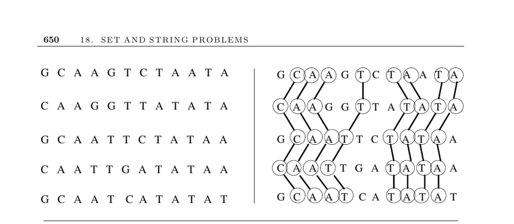

- **18.8 Longest Common Substring/Subsequence**
  - **Problem description and applications**
    - The problem determines the longest string whose characters appear as a substring or subsequence in all input strings.
    - Applications include finding consensus among biological sequences to identify conserved gene regions.
    - The longest common subsequence (LCS) is crucial for understanding evolutionary functional regions.
    - Relevant resource: [ClustalW multiple sequence alignment tool](http://www.ebi.ac.uk/Tools/clustalw/).
  - **Longest common subsequence algorithm**
    - The LCS problem is a special case of edit distance with only insertions and deletions allowed.
    - The length of LCS can be computed in O(nm) dynamic programming time using a matrix M with recurrence relations.
    - Reconstruction of the LCS is done by backtracking from M[n,m].
    - Further reading: [Section 18.4 Edit Distance](page 631).
  - **Longest common substring vs subsequence**
    - Longest common substrings require consecutive character matches, utilized in plagiarism detection.
    - The longest common substring can be found in linear time using suffix trees and depth-first traversal.
    - Internal reference: [Section 12.3 Suffix Trees](page 377).
  - **Optimized algorithms for LCS**
    - For strings with few repeated characters, the Hunt-Szymanski algorithm finds LCS in O((n + r) log n) time.
    - The approach uses bucketing by character and treats matching pairs as points forming monotone paths.
    - When strings are permutations, the problem simplifies and runs in O(n log n) time using longest increasing subsequence.
    - Relevant resource: Hunt & Szymanski's original algorithm [HS77].
  - **Multiple string alignment**
    - LCS generalizes to k strings with dynamic programming in O(2^k n^k) time, which is exponential and impractical for large k.
    - Heuristics merge pairwise alignments iteratively but optimal alignments cannot be guaranteed.
    - Multiple sequence alignment tools include ClustalW and MSA package.
    - Further reading: Gusfield [Gus97], Durbin [DEKM98], and [http://www.ncbi.nlm.nih.gov/CBBresearch/Schaffer/msa.html](http://www.ncbi.nlm.nih.gov/CBBresearch/Schaffer/msa.html).
  - **Other considerations and related work**
    - Bit-parallel algorithms and the four Russians technique improve LCS computation for constant alphabets.
    - Expected LCS length for random strings with alphabet size α is well-studied, see Dancik [Dan94].
    - Plagiarism detection relies on longest common substring identification [SWA03].
    - Related problems include approximate string matching and shortest common superstring (see page 654).
