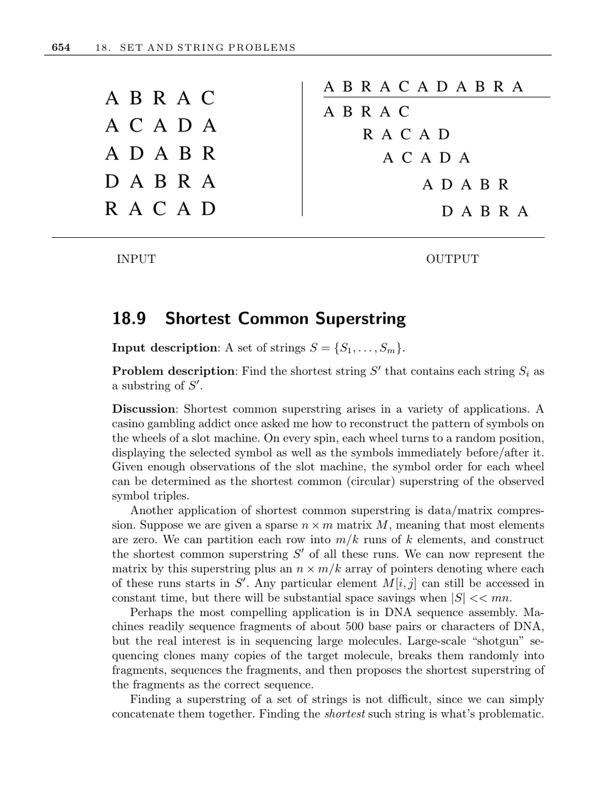

- **18.9 Shortest Common Superstring**
  - **Problem Description**
    - The shortest common superstring is the minimal string containing all input strings as substrings.
    - This problem is NP-complete for all reasonable classes of strings.
    - The problem arises in applications such as slot machine pattern reconstruction, data compression, and DNA sequence assembly.
    - Finding a shortest superstring by direct concatenation is easy, but minimizing its length is computationally difficult.
  - **Reduction to Traveling Salesman Problem (TSP)**
    - Construct an overlap graph where vertices represent input strings and edge weights represent the non-overlapping portion between strings.
    - The problem reduces to finding a minimum-weight path visiting all vertices in the graph.
    - Edge weights are asymmetric, making the resulting TSP instance asymmetric and harder to solve.
  - **Greedy Heuristic Approach**
    - Iteratively merge the two strings with maximum overlap until only one string remains.
    - The heuristic can be implemented in linear time using suffix trees to efficiently find overlaps.
    - Greedy may yield superstrings up to 3.5 times longer than optimal, but typically performs much better in practice.
    - Examples show cases where greedy is fooled, but it never exceeds a 3.5 approximation ratio.
  - **Advanced Complexity and Variations**
    - Adding forbidden negative strings (strings that cannot appear in the final superstring) makes the problem NP-complete unless a spacer character is allowed.
    - Handling substitution errors in strings is studied in advanced shortest common superstring variants.
  - **Applications and Implementations**
    - DNA sequence assembly uses shortest common superstrings to piece together fragments from shotgun sequencing.
    - CAP3 and PCAP are notable assemblers using these principles, capable of handling mammalian-scale data.
    - The Celera assembler, originally for human genome sequencing, is available as open source.
  - **Notes and Further Reading**
    - Theoretical and algorithmic progress on shortest common superstring and approximations are documented by Blum et al. [BJL+94] and others.
    - Genetic algorithm approaches and heuristic performance experiments appear in [ZS04] and [RBT04].
    - Analytical results on random sequences reveal limits on compression via shortest common superstring [YZ99].
    - Recommended readings include surveys by Myers and Kececioglu [MKT07, Mye99a] and substitution error handling by Kececioglu and Myers [KM95].
    - Links to assemblers: [CAP3 and PCAP](http://seq.cs.iastate.edu/), [Celera assembler](http://sourceforge.net/projects/wgs-assembler/).
