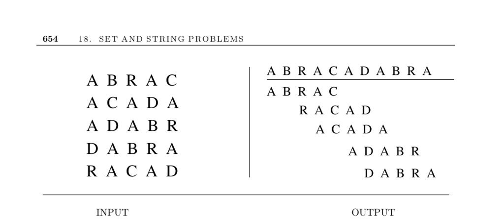

- **18.9 Shortest Common Superstring**
  - **Problem Description**
    - The problem is to find the shortest string containing each input string as a substring.
    - This problem is NP-complete for all reasonable classes of strings.
  - **Applications**
    - Slot machine symbol pattern reconstruction uses shortest common circular superstrings.
    - Data compression of sparse matrices can be achieved by representing runs as shortest common superstrings.
    - DNA sequence assembly uses shortest superstrings of randomly broken fragments to propose the target sequence.
  - **Relation to Traveling Salesman Problem (TSP)**
    - The shortest common superstring problem reduces to an asymmetric TSP on an overlap graph.
    - Edge weights equal string length minus overlap; edge weights are not symmetric.
    - Asymmetric TSP is significantly harder to solve than symmetric versions.
  - **Greedy Heuristic**
    - Greedily merges string pairs with maximum overlap until one string remains.
    - Can be implemented in linear time using suffix trees to efficiently find overlaps.
    - The heuristic can produce results up to 3.5 times longer than optimal but often performs better.
    - Example failure: greedily merging certain strings can preclude optimal overlap for others.
  - **Advanced Challenges**
    - The problem becomes more complex when negative strings (forbidden substrings) are introduced.
    - Deciding existence of a consistent superstring excluding negative strings is NP-complete unless spacers are allowed.
  - **Implementations and Tools**
    - High-performance DNA assemblers include CAP3 and PCAP, useful for large-scale assemblies.
    - The Celera assembler, originally used for human genome sequencing, is available as open source.
    - Further information and source files accessible via provided URLs.
  - **Notes and Further Reading**
    - Surveys on shortest common superstring and its DNA assembly application exist [MKT07, Mye99a].
    - Algorithms exist for error-tolerant fragment assembly [KM95].
    - Constant-factor approximations improve upon greedy, with best proved ratio 3.5 [KS05a].
    - Greedy heuristics usually produce near-optimal results within 1.4% [RBT04].
    - Analytical and experimental studies on heuristics and compression ratios appear in [YZ99], [ZS04].
    - Suggested external resource: [CAP3 assembler](http://seq.cs.iastate.edu/)
