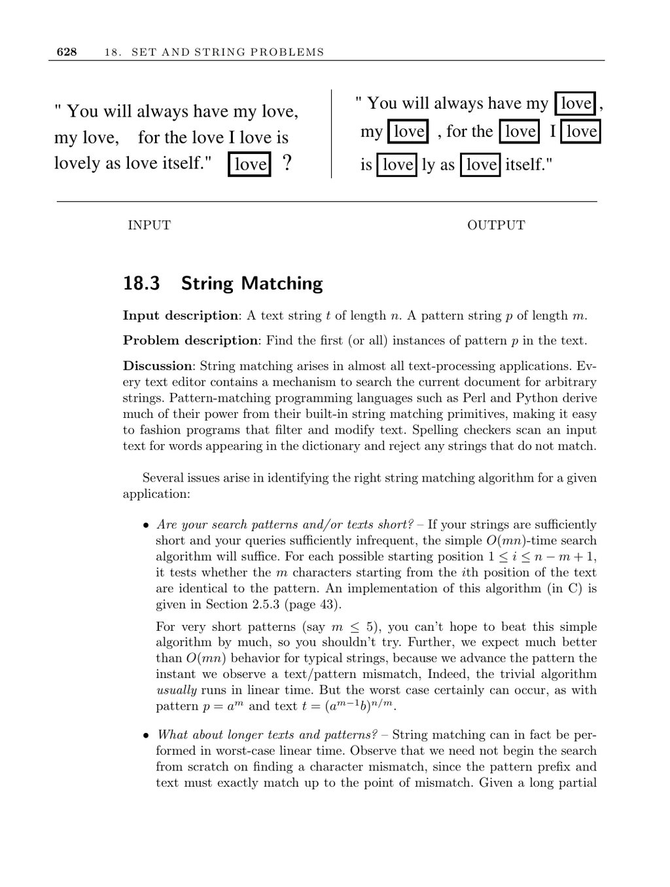

- **18.3 String Matching**  
  - Exact pattern matching locates first or all instances of pattern p in text t.  
  - Simple O(mn)-time algorithm suffices for short patterns and infrequent queries.  
  - Knuth-Morris-Pratt (KMP) algorithm preprocesses patterns for worst-case linear time.  
  - Boyer-Moore algorithm matches patterns right-to-left and can skip large text sections on mismatch.  
  - Specialized data structures like suffix trees accelerate multiple queries on fixed texts.  
  - Aho-Corasick algorithm efficiently matches multiple fixed patterns by building a finite automaton.  
  - Regular expressions are matched by constructing and simulating equivalent finite automata.  
  - Exact matching algorithms do not handle spelling errors; approximate matching is a separate topic.  
  - Implementations include Strmat (C) and SPARE Parts (C++), with GNU grep and Boost providing regex and search utilities.  
  - Further reading includes [CLRS01](https://mitpress.mit.edu/books/introduction-algorithms), [Gus97](http://www.cs.ucdavis.edu/~gusfield/strmat.html), and [AC75](https://dl.acm.org/doi/10.1145/360825.360855).
