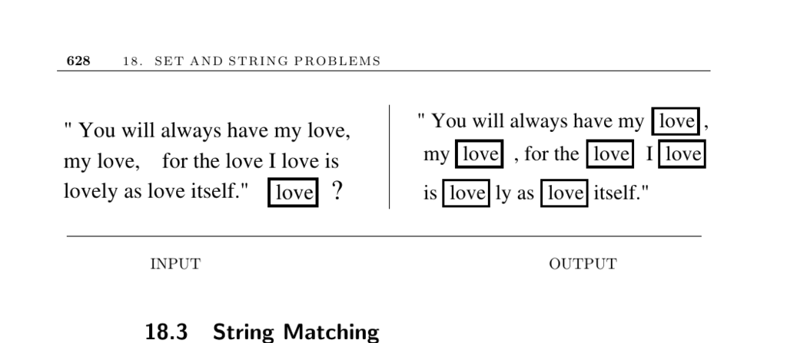

- **18.3 String Matching**
  - **Input description**
    - The input includes a text string t of length n and a pattern string p of length m.
  - **Problem description**
    - The task is to find the first or all instances of pattern p in the text string t.
  - **Discussion**
    - String matching appears in almost all text-processing applications including text editors and spelling checkers.
    - The simple O(mn)-time search algorithm tests every possible starting position for pattern matches, suitable for short strings or infrequent queries.
    - The Knuth-Morris-Pratt algorithm preprocesses the pattern to allow efficient linear-time string matching by avoiding redundant comparisons.
    - The Boyer-Moore algorithm matches from right to left and can skip large portions of text on mismatches, often testing only n/m characters.
    - For multiple queries on the same text, suffix trees and suffix arrays optimize repeated searches.
    - For searching many texts using the same patterns, building a finite automaton via the Aho-Corasick algorithm allows efficient recognition of multiple patterns.
    - Approximate string matching for texts or patterns with spelling errors requires different algorithms covered in Section 18.4.
    - Pattern recognition for regular expressions uses finite automata construction and simulation.
  - **Implementations**
    - Strmat provides C programs for exact pattern matching including variants of KMP and Boyer-Moore algorithms ([Strmat](http://www.cs.ucdavis.edu/~gusfield/strmat.html)).
    - SPARE Parts offers a C++ toolkit implementing classical string-matching algorithms for single and multiple patterns ([SPARE Parts](http://www.fastar.org/)).
    - GNU grep supports fast regular expression matching with hybrids of deterministic matchers and Boyer-Moore searches ([GNU grep](http://directory.fsf.org/project/grep/)).
    - The Boost string algorithms library supplies C++ string operation routines including search ([Boost](http://www.boost.org/doc/html/string_algo.html)).
  - **Notes**
    - Comprehensive coverage of exact string matching can be found in notable references like [Gus97], [CHL07], and [NR07].
    - Historical challenges in proving string matching algorithm correctness are clarified in [Gus97].
    - Surveys on pattern matching including regular expressions are available in [Aho90], with Aho-Corasick detailed in [AC75].
    - Empirical performance varies by string properties and alphabet size; Boyer-Moore is recommended for long patterns ([DB86], [Hor80], [Lec95], [dVS82]).
    - The Karp-Rabin algorithm uses hashing for expected linear time but has quadratic worst case and is less efficient practically ([KR87]).
  - **Related Problems**
    - Related topics include suffix trees and approximate string matching covered in subsequent sections.
