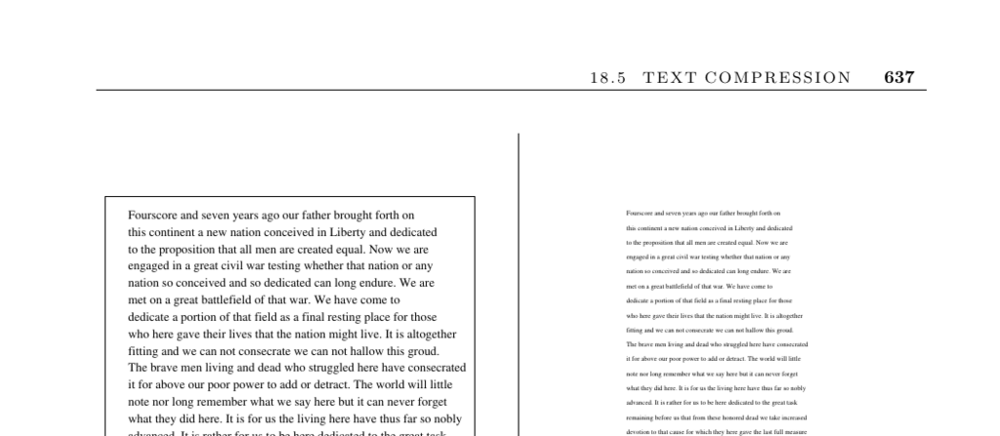

- **Text Compression**
  - **Input Description**
    - The input is a text string S.
    - The goal is to produce a shorter text string S′ that can be losslessly reconstructed to S.
  - **Problem Description**
    - Data compression aims to find space-efficient encodings for data files.
    - Increased data volume and network usage drive interest in compression.
    - Compression reduces storage requirements and effective transmission bandwidth.
  - **Discussion**
    - Compression methods vary between lossy and lossless, depending on fidelity requirements.
    - Preprocessing, such as removing redundancy or applying transforms like Burrows-Wheeler, can improve compression effectiveness.
    - Patent restrictions affect algorithm choice; some patents have expired while others remain contentious.
    - Simple methods like run-length coding suit some image data but fail on noisy images.
    - Real-time compression requires balancing speed and compression ratio, with decompression often prioritized for speed.
  - **Text Compression Algorithms**
    - **Static Algorithms**
      - Build a coding table from the entire document before encoding.
      - Huffman codes assign variable-length codes based on symbol frequency.
      - Requires two passes over data and storing the coding table with the output.
      - Best suited for nonuniform symbol distributions but limited on higher-order redundancy.
      - See [CLRS Book](https://mitpress.mit.edu/books/introduction-algorithms) for foundational Huffman coding.
    - **Adaptive Algorithms**
      - Build and update coding tables dynamically during encoding and decoding.
      - Lempel-Ziv algorithms adapt to local character distributions and capture frequent substrings.
      - Can achieve robust compression across varied data types and adapt to locality in text.
      - Widely deployed in popular tools like gzip.
      - Original algorithms described in [Lempel-Ziv papers](https://ieeexplore.ieee.org/document/1054015).
  - **Implementations**
    - gzip uses an LZ variant and is available under GNU license.
    - bzip2 uses Burrows-Wheeler transform for better compression at the cost of speed.
    - Advanced compressors maximize compression but at high computational cost.
    - Various implementations and comparisons listed at [Maximum Compression](http://www.maximumcompression.com).
  - **Notes and References**
    - Foundational texts include Sayood [Say05] and Salomon [Sal06].
    - Classical references include Bell, Cleary, and Witten [BCW90].
    - Research and updates published at the IEEE Data Compression Conference [DCC](http://www.cs.brandeis.edu/~dcc).
    - The Burrows-Wheeler transform introduced in [BW94].
