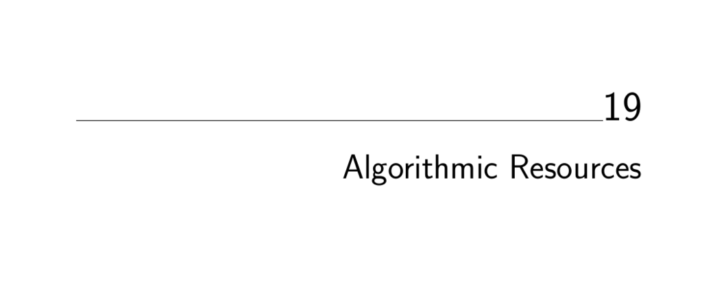

- **Algorithmic Resources**
  - **19.1 Software Systems**
    - **19.1.1 LEDA**
      - LEDA is a comprehensive C++ library for combinatorial computing, developed by experts in Germany.
      - It offers well-implemented data structures and graph algorithms, prioritizing generality.
      - Since 2001, LEDA is commercially distributed by Algorithmic Solutions Software GmbH.
      - A free basic edition was released in 2008 with limited features; full licenses are reasonably priced.
      - Further reading: [Algorithmic Solutions](http://www.algorithmic-solutions.com/)
    - **19.1.2 CGAL**
      - CGAL provides efficient and reliable C++ geometric algorithms, including triangulations and Voronoi diagrams.
      - It supports 2D and 3D computations with broad coverage of geometric problems.
      - Distributed under a dual-license system: free for open source, commercial license required otherwise.
      - Further reading: [CGAL](http://www.cgal.org)
    - **19.1.3 Boost Graph Library**
      - Boost offers peer-reviewed, portable C++ libraries with a Boost License that permits commercial and noncommercial use.
      - The Boost Graph Library includes adjacency representations and fundamental graph algorithms.
      - It follows the generic programming style of the STL.
      - Boost also includes libraries for string processing and numeric computation.
      - Further reading: [Boost Graph Library](http://www.boost.org/libs/graph/doc)
    - **19.1.4 GOBLIN**
      - GOBLIN is a C++ library specializing in graph optimization algorithms with strong network flow and matching implementations.
      - It includes a generic branch-and-bound module for hard problems like independent set and vertex coloring.
      - Maintained by Christian Fremuth-Paeger and licensed under GNU LGPL.
      - Provides a Tcl/Tk graphical interface.
      - Further reading: [GOBLIN](http://www.math.uni-augsburg.de/~fremuth/goblin.html)
    - **19.1.5 Netlib**
      - Netlib is a large, accessible online repository for mathematical software codes, tables, and papers.
      - It aggregates resources from multiple sources and offers detailed indices and search facilities.
      - Contains the Guide to Available Mathematical Software (GAMS), a service providing curated software indices.
      - Further reading: [Netlib](http://www.netlib.org), [GAMS](http://gams.nist.gov)
    - **19.1.6 Collected Algorithms of the ACM**
      - CALGO distributes validated algorithm implementations via refereed journal articles.
      - Mostly focused on numerical computing, primarily in Fortran, with some combinatorial algorithms included.
      - Over 850 algorithms have been collected, maintained at ACM and Netlib websites.
      - Further reading: [CALGO](http://www.acm.org/calgo/)
    - **19.1.7 SourceForge and CPAN**
      - SourceForge hosts over 160,000 open source projects including graph libraries and optimization engines.
      - CPAN is the largest repository of Perl modules and scripts for algorithm implementation in Perl.
      - Use these platforms to find or reuse existing software before developing new code.
      - Further reading: [SourceForge](http://sourceforge.net/), [CPAN](http://www.cpan.org/)
    - **19.1.8 The Stanford GraphBase**
      - The Stanford GraphBase is a literate program by Donald Knuth containing implementations of classical combinatorial algorithms.
      - It provides graph generators from diverse sources such as literature and economics.
      - Useful primarily as a test data generator, not for large-scale application development.
      - Includes machine-independent random number generators for reproducible graphs.
      - Further reading: [Stanford GraphBase](http://www-cs-faculty.stanford.edu/~knuth/sgb.html)
    - **19.1.9 Combinatorica**
      - Combinatorica is a Mathematica package offering over 450 combinatorics and graph theory algorithms.
      - It is highly comprehensive and well-integrated but relatively slow due to Mathematica's interpreted language.
      - Best suited for small problem experimentation and algorithm prototyping.
      - Included in Mathematica and available online.
      - Further reading: [Combinatorica](http://www.combinatorica.com)
    - **19.1.10 Programs from Books**
      - Several algorithms books provide executable implementations for exposition and practical use.
      - Notable examples include Skiena’s "Programming Challenges", Nijenhuis and Wilf’s combinatorial algorithms in Fortran, O’Rourke’s computational geometry in C, Sedgewick’s "Algorithms in C++", and discrete optimization in Pascal by Syslo et al.
      - These resources often provide clean, small code bases useful for learning or building simple applications.
      - Many are available at Stony Brook’s algorithm repository.
      - Further reading: [Programming Challenges](http://www.programming-challenges.com), [Combinatorica], [O'Rourke Code](http://maven.smith.edu/~orourke/code.html)
  - **19.2 Data Sources**
    - **Test Data Libraries**
      - TSPLIB offers large, real-world traveling salesman problem instances from diverse applications.
      - Stanford GraphBase provides portable graph generators from multiple domains for testing.
      - DIMACS Challenge datasets and generators focus on producing difficult or representative instances for graph and logic problems.
      - Further reading: [TSPLIB](http://www.iwr.uni-heidelberg.de/groups/comopt/software/TSPLIB95/), [DIMACS](http://dimacs.rutgers.edu/Challenges)
  - **19.3 Online Bibliographic Resources**
    - **Digital Libraries and Search Tools**
      - ACM Digital Library contains extensive bibliographic references and links to computer science publications.
      - Google Scholar restricts searches to academic-like documents and tracks citation information.
      - Amazon.com serves as a comprehensive book catalog with many recent titles indexed digitally.
      - These resources facilitate thorough literature review and research updating.
      - Further reading: [ACM Digital Library](http://portal.acm.org/), [Google Scholar](http://scholar.google.com/), [Amazon](http://www.amazon.com)
  - **19.4 Professional Consulting Services**
    - **Algorist Technologies**
      - Algorist Technologies provides expert algorithm design and implementation consulting on short-term engagements.
      - The firm has a track record of improving software performance within days through on-site collaboration.
      - Services include longer-term consulting and contracting as well.
      - Contact information: website, telephone, and email provided.
      - Further reading: [Algorist Technologies](http://www.algorist.com)
