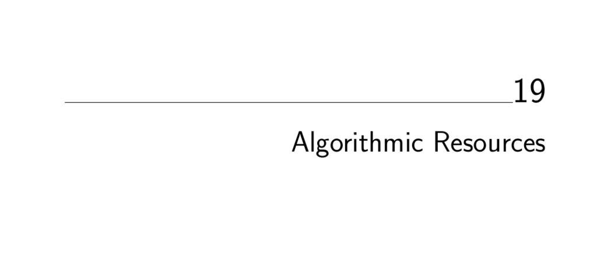

- **Algorithmic Resources**  
  - **19.1 Software Systems**  
    - **19.1.1 LEDA**  
      - LEDA is a comprehensive C++ library of efficient data types and combinatorial algorithms.  
      - It originated from a Max-Planck-Institut group and emphasizes algorithmic sophistication and project continuity.  
      - LEDA offers graph types, dictionaries, priority queues, and computational geometry tools including visualization.  
      - A free basic edition was released in 2008, with commercial licenses required for full features from [Algorithmic Solutions](http://www.algorithmic-solutions.com/).  
    - **19.1.2 CGAL**  
      - CGAL provides efficient and reliable C++ geometric algorithms, including triangulations and Voronoi diagrams.  
      - It supports 2D and 3D geometric operations with a comprehensive range of functionalities.  
      - CGAL uses a dual-license scheme, free for open source but requires commercial licensing otherwise.  
      - Further info available at [CGAL](https://www.cgal.org).  
    - **19.1.3 Boost Graph Library**  
      - The Boost Graph Library is a free, peer-reviewed, portable C++ collection of graph data structures and basic algorithms.  
      - Its interface is generic and modeled like the C++ STL for flexibility.  
      - Boost libraries also cover string processing and numeric computation and are under a permissive Boost license.  
      - Documentation can be found at [Boost Graph Library](http://www.boost.org/libs/graph/doc).  
    - **19.1.4 GOBLIN**  
      - GOBLIN is a C++ library specializing in graph optimization including network flows, matching, and branch-and-bound for hard problems.  
      - It is maintained by Christian Fremuth-Paeger and distributed under GNU lesser public license.  
      - It has a Tcl/Tk interface and contains some unique algorithms not in Boost or LEDA.  
      - Available at [GOBLIN](http://www.math.uni-augsburg.de/~fremuth/goblin.html).  
    - **19.1.5 Netlib**  
      - Netlib is an extensive online repository for mathematical software, codes, tables, and papers.  
      - It is notable for its breadth and ease of access to specialized mathematical software.  
      - The Guide to Available Mathematical Software (GAMS) indexes Netlib’s and other software resources.  
      - Find more at [Netlib](https://www.netlib.org) and [GAMS](https://gams.nist.gov).  
    - **19.1.6 Collected Algorithms of the ACM**  
      - CALGO is a collection of refereed algorithm implementations originally distributed through Communications of the ACM.  
      - Over 850 mostly numerical algorithms are included, mainly in Fortran, with some combinatorial algorithms.  
      - Implementations are validated and available at [CALGO](https://www.acm.org/calgo) and Netlib.  
    - **19.1.7 SourceForge and CPAN**  
      - SourceForge hosts over 160,000 open source projects including graph libraries like JUNG and optimization tools.  
      - CPAN is a large archive network of Perl modules and scripts, recommended for Perl development.  
      - SourceForge is at [SourceForge](https://sourceforge.net) and CPAN at [CPAN](https://www.cpan.org).  
    - **19.1.8 The Stanford GraphBase**  
      - The Stanford GraphBase is a literate programming project by Knuth providing combinatorial algorithm implementations in CWEB.  
      - It contains important algorithms, recreational problems, and rich graph instance generators derived from diverse sources.  
      - It is most useful for creating test data and reproducible random graphs for experimental evaluation.  
      - Accessible at [Stanford GraphBase](http://www-cs-faculty.stanford.edu/~knuth/sgb.html).  
    - **19.1.9 Combinatorica**  
      - Combinatorica is a Mathematica package with over 450 combinatorics and graph theory algorithms.  
      - It allows integrated experimentation with discrete structures but is relatively slow due to Mathematica’s interpreted nature.  
      - Best suited for small problems and educational purposes; included with Mathematica’s discrete math packages.  
      - Visit [Combinatorica](http://www.combinatorica.com) for details.  
    - **19.1.10 Programs from Books**  
      - Several algorithm books include working code useful for learning and simple applications.  
      - Notable collections include Programming Challenges by Skiena, Nijenhuis and Wilf’s combinatorial algorithms, O’Rourke’s Computational Geometry in C, Sedgewick’s Algorithms in C++, and Syslo et al.’s Discrete Optimization in Pascal.  
      - These collections provide reliable implementations for dynamic programming, combinatorics, geometry, graph theory, and optimization.  
      - Many are available from the [algorithm repository](http://www.cs.sunysb.edu/~algorith).  
  - **19.2 Data Sources**  
    - **Test Data for Algorithms**  
      - TSPLIB offers a respected library of large, real-world TSP instances used as hard benchmarks.  
      - The Stanford GraphBase includes graph generators from practical and theoretical sources for testing.  
      - DIMACS Challenge data provides instance generators focused on difficult and representative problem sets.  
      - TSPLIB can be found at [TSPLIB](http://www.iwr.uni-heidelberg.de/groups/comopt/software/TSPLIB95/).  
      - DIMACS Challenges are hosted at [DIMACS](http://dimacs.rutgers.edu/Challenges).  
  - **19.3 Online Bibliographic Resources**  
    - **Key Literature Search Tools**  
      - The ACM Digital Library contains extensive bibliographic information and full-texts of computer science papers.  
      - Google Scholar limits searches to academic papers and supports citation tracking to assess significance.  
      - Amazon.com is useful for locating books and accessing digitized content relevant to algorithms.  
      - Visit [ACM Digital Library](https://portal.acm.org), [Google Scholar](https://scholar.google.com), and [Amazon](https://www.amazon.com).  
  - **19.4 Professional Consulting Services**  
    - **Algorist Technologies**  
      - Algorist Technologies provides expert short-term and longer-term algorithm design and implementation consulting.  
      - Consultants typically engage onsite for intensive sessions aiding client development teams.  
      - The firm has a strong track record of performance gains across several companies and applications.  
      - Contact information and services are detailed at [Algorist](http://www.algorist.com).
