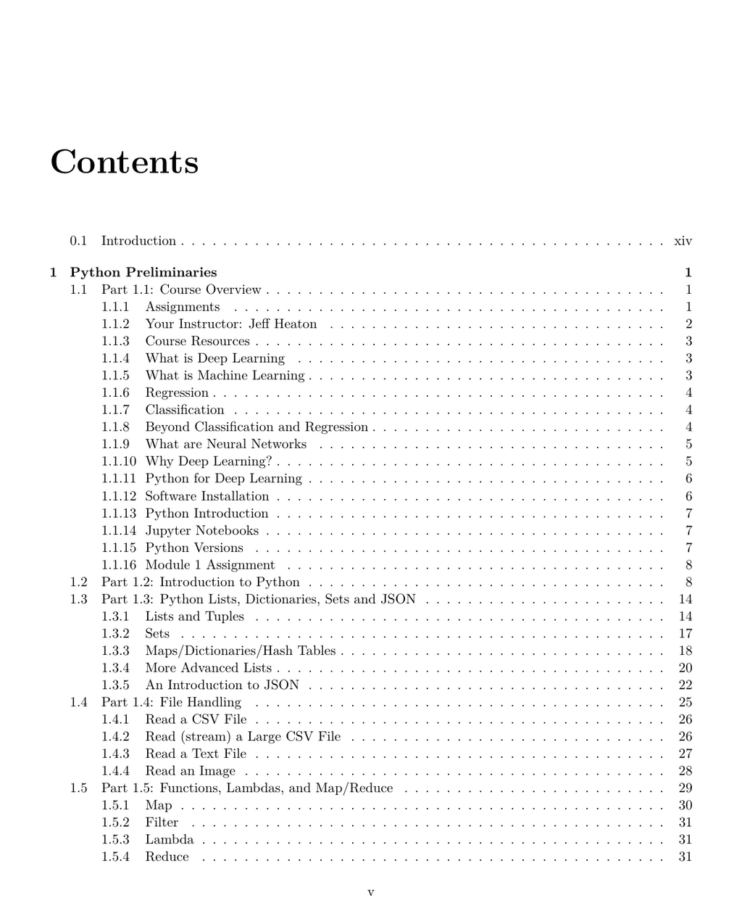

- **Python Preliminaries**
  - **Part 1.1: Course Overview**
    - Introduces the course structure and objectives related to deep learning and Python usage.
    - Covers basics of assignments, instructor and course resources.
    - Discusses foundational concepts such as deep learning, machine learning, regression, classification, and neural networks.
    - Provides software installation guidance and Python basics including Jupyter, versions, and an introductory assignment.
    - Further reading: [Deep Learning Book](https://www.deeplearningbook.org/)
  - **Part 1.2: Introduction to Python**
    - Presents fundamental Python concepts needed for the course.
    - Explains syntax and programming paradigms essential for machine learning tasks.
  - **Part 1.3: Python Lists, Dictionaries, Sets and JSON**
    - Explores Python data structures: lists, tuples, sets, dictionaries, and JSON handling.
    - Covers advanced list operations and JSON introduction for data exchange.
  - **Part 1.4: File Handling**
    - Describes methods to read CSV, large CSVs, text files, and images in Python.
    - Emphasizes stream handling for large files.
  - **Part 1.5: Functions, Lambdas, and Map/Reduce**
    - Explains functional programming tools in Python: map, filter, lambda, and reduce.
    - Discusses their applications in data transformation and processing.

- **Python for Machine Learning**
  - **Part 2.1: Introduction to Pandas**
    - Introduces the Pandas library for data manipulation.
    - Covers handling missing values, outliers, field dropping, concatenation, training-validation split, and data saving.
    - Includes an assignment to consolidate learning.
    - Further reading: [Pandas Documentation](https://pandas.pydata.org/docs/)
  - **Part 2.2: Categorical and Continuous Values**
    - Details encoding techniques for continuous and categorical variables.
    - Describes dummy encoding, target encoding, and ordinal encoding strategies.
  - **Part 2.3: Grouping, Sorting, and Shuffling**
    - Explains data set operations like shuffling, sorting, and grouping using Pandas.
  - **Part 2.4: Apply and Map**
    - Discusses how to use apply and map functions with dataframes for feature engineering.
  - **Part 2.5: Feature Engineering**
    - Covers creation of calculated fields and real-world examples such as handling addresses and API key manipulations.

- **Introduction to TensorFlow**
  - **Part 3.1: Deep Learning and Neural Network Introduction**
    - Details neural network concepts including neurons, layers, types of neurons, and their roles.
    - Explains bias neurons, context neurons, and various activation functions, emphasizing ReLU and softmax.
    - Provides rationale for bias neurons and choice of activation functions.
  - **Part 3.2: Introduction to TensorFlow and Keras**
    - Introduces TensorFlow and Keras frameworks.
    - Covers TensorFlow usage, linear algebra examples, Mandelbrot set programming, and basic regression and classification.
    - Discusses neural network hyperparameters and output control.
  - **Part 3.3: Saving and Loading a Keras Neural Network**
    - Explains methods to persist and reload trained Keras models.
  - **Part 3.4: Early Stopping in Keras to Prevent Overfitting**
    - Describes early stopping techniques for classification and regression tasks to avoid overfitting.
  - **Part 3.5: Extracting Weights and Manual Network Calculation**
    - Covers network weight initialization and manual forward propagation calculations.

- **Training for Tabular Data**
  - **Part 4.1: Encoding a Feature Vector for Keras Deep Learning**
    - Explains preparing feature vectors and generating X (inputs) and Y (outputs) for classification and regression.
    - Includes an assignment to apply these techniques.
  - **Part 4.2: Multiclass Classification with ROC and AUC**
    - Details the use of ROC charts and AUC for binary and multiclass classification evaluation.
    - Covers classification error metrics, accuracy calculation, and log loss computation.
  - **Part 4.3: Keras Regression for Deep Neural Networks with RMSE**
    - Introduces error metrics including mean square error and root mean square error.
    - Discusses lift charts for performance interpretation.
  - **Part 4.4: Training Neural Networks**
    - Describes backpropagation variants: classic, momentum, batch, online stochastic gradient descent, and ADAM optimizer.
    - Compares methods and explains specifying update rules in TensorFlow.
  - **Part 4.5: Error Calculation from Scratch**
    - Explains manual error calculation techniques for regression and classification.

- **Regularization and Dropout**
  - **Part 5.1: Introduction to Regularization: Ridge and Lasso**
    - Details L1 (Lasso), L2 (Ridge), and ElasticNet regularization methods.
    - Explains use cases in linear regression to prevent overfitting.
  - **Part 5.2: Using K-Fold Cross-validation with Keras**
    - Covers K-Fold cross-validation for regression and classification including stratified and out-of-sample predictions.
    - Details combined usage of cross-validation and holdout sets.
  - **Part 5.3: L1 and L2 Regularization to Decrease Overfitting**
    - Provides guidelines to apply regularization techniques in neural networks.
  - **Part 5.4: Drop Out for Keras to Decrease Overfitting**
    - Explains dropout implementation in Keras for regularization.
  - **Part 5.5: Benchmarking Regularization Techniques**
    - Discusses benchmarking practices including bootstrapping for regression and classification.
    - Includes additional reading on hyperparameter tuning.

- **Convolutional Neural Networks (CNN) for Computer Vision**
  - **Part 6.1: Image Processing in Python**
    - Describes image creation, pixel-level transformation, standardization, and noise addition.
    - Includes a practical assignment.
  - **Part 6.2: Keras Neural Networks for Digits and Fashion MNIST**
    - Reviews computer vision datasets: MNIST digits, Fashion MNIST, and CIFAR.
    - Covers CNN mechanics including convolution and max pooling layers.
    - Shows training, evaluation, and visualization of CNNs on digits and fashion imagery.
  - **Part 6.3: Implementing a ResNet in Keras**
    - Introduces Residual Networks (ResNet) with comparison of Keras Sequence and Functional Model APIs.
    - Details implementation of ResNet V1 and V2 on the CIFAR dataset.
  - **Part 6.4: Using Your Own Images with Keras**
    - Guides on preparing and using custom image data for CNNs.
  - **Part 6.5: Recognizing Multiple Images with Darknet**
    - Explains Darknet/YOLO object detection architecture.
    - Covers installation, weight transfer, and running DarkFlow with YOLO in Python.

- **Generative Adversarial Networks**
  - **Part 7.1: Introduction to GANS for Image and Data Generation**
    - Provides an overview of GANs and their role in generating images and data.
  - **Part 7.2: Implementing DCGANs in Keras**
    - Covers Deep Convolutional GAN implementation details.
  - **Part 7.3: Face Generation with StyleGAN and Python**
    - Details high-resolution face generation using StyleGAN in Google CoLab and Python.
    - Explores latent vector manipulation and training custom GANs.
  - **Part 7.4: GANS for Semi-Supervised Training in Keras**
    - Explains semi-supervised training approaches for classification and regression with GANs.
  - **Part 7.5: An Overview of GAN Research**
    - Surveys significant GAN projects and further research topics.

- **Kaggle Data Sets**
  - **Part 8.1: Introduction to Kaggle**
    - Describes Kaggle platform, ranking system, competition processes, and submission preparation.
    - Lists popular competitions and includes an assignment.
  - **Part 8.2: Building Ensembles with Scikit-Learn and Keras**
    - Explores evaluation of feature importance and input perturbation ranking for classification and regression.
    - Demonstrates neural network ensembles and biological response modeling.
  - **Part 8.3: Architecting Network: Hyperparameters**
    - Discusses network design including hidden layers, neurons, activation functions, regularization, batch normalization, and training parameters.
  - **Part 8.4: Bayesian Hyperparameter Optimization for Keras**
    - Introduces Bayesian optimization techniques to tune Keras models.
  - **Part 8.5: Current Semester’s Kaggle**
    - Provides case studies of Kaggle competitions using Iris and MPG datasets with assigned tasks.

- **Transfer Learning**
  - **Part 9.1: Introduction to Keras Transfer Learning**
    - Explains transfer learning principles and provides practical examples.
  - **Part 9.2: Popular Pretrained Neural Networks for Keras**
    - Lists common pretrained models including DenseNet, Inception, MobileNet, NASNet, ResNet, VGG, and Xception.
  - **Part 9.3: Transfer Learning for Computer Vision and Keras**
    - Covers application of transfer learning for vision tasks using Keras.
  - **Part 9.4: Transfer Learning for Languages and Keras**
    - Discusses transfer learning applications in language models.
  - **Part 9.5: Transfer Learning for Keras Feature Engineering**
    - Shows using transfer learning for feature engineering in Keras.

- **Time Series in Keras**
  - **Part 10.1: Time Series Data Encoding**
    - Describes encoding strategies for time series data in neural networks.
    - Includes an assignment for hands-on practice.
  - **Part 10.2: Programming LSTM with Keras and TensorFlow**
    - Explains LSTM architecture and implementation for sequence modeling.
    - Includes examples such as sunspots prediction.
  - **Part 10.3: Text Generation with LSTM**
    - Discusses character-level text generation using LSTM networks.
  - **Part 10.4: Image Captioning with Keras and TensorFlow**
    - Details data preparation, dataset cleaning, vision model selection, embedding loading, network building, training, and evaluation for image captioning.
  - **Part 10.5: Temporal CNN in Keras and TensorFlow**
    - Demonstrates applying temporal CNNs to time series forecasting with examples.

- **Natural Language Processing and Speech Recognition**
  - **Part 11.1: Getting Started with Spacy in Python**
    - Introduces installation and basic NLP techniques including tokenization, sentence diagramming, and stop word processing.
  - **Part 11.2: Word2Vec and Text Classification**
    - Covers Word2Vec embedding generation and recommended software tools.
  - **Part 11.3: What are Embedding Layers in Keras**
    - Explains embedding layers, transfer, and training embeddings in Keras.
  - **Part 11.4: Natural Language Processing with Spacy and Keras**
    - Presents word-level text generation techniques.
  - **Part 11.5: Learning English from Scratch with Keras and TensorFlow**
    - Details the end-to-end process for language learning models including data fetching, vocabulary building, training, evaluation, and custom queries.

- **Reinforcement Learning**
  - **Part 12.1: Introduction to the OpenAI Gym**
    - Introduces the OpenAI Gym platform and environment rendering techniques including Colab compatibility.
  - **Part 12.2: Introduction to Q-Learning**
    - Describes Q-learning fundamentals and the Mountain Car problem example with reinforcement learning concepts.
  - **Part 12.3: Keras Q-Learning in the OpenAI Gym**
    - Covers DQN implementation, hyperparameters, environment setup, agent policies, training, and evaluation.
  - **Part 12.4: Atari Games with Keras Neural Networks**
    - Provides details on Atari 2600 specs and OpenAI Gym Atari environments.
    - Includes agent design, metrics, replay buffers, training, visualization, and video recording.
  - **Part 12.5: Application of Reinforcement Learning**
    - Guides on creating custom environments, testing, hyperparameter selection, data collection, training, and visualization of agents.

- **Advanced/Other Topics**
  - **Part 13.1: Flask and Deep Learning Web Services**
    - Explains building simple Flask web services with deep learning models, including client interaction and image handling.
  - **Part 13.2: Interrupting and Continuing Training**
    - Discusses techniques to pause and resume neural network training sessions.
  - **Part 13.3: Using a Keras Deep Neural Network with a Web Application**
    - Covers integration of Keras models within web applications.
  - **Part 13.4: When to Retrain Your Neural Network**
    - Describes dataset preprocessing, KS-Statistic usage, and detecting drift between training and testing datasets.
  - **Part 13.5: Using a Keras Deep Neural Network with a Web Application**
    - Details converting Keras models to CoreML and creating iOS applications.

- **Other Neural Network Techniques**
  - **Part 14.1: What is AutoML**
    - Presents AutoML concepts and demonstrates local and Google Cloud AutoML usage.
    - Includes a simple AutoML system and example program.
  - **Part 14.2: Using Denoising AutoEncoders in Keras**
    - Covers function approximation, multi-output regression, simple and image autoencoders, standardization, noise addition, and denoising techniques.
  - **Part 14.3: Anomaly Detection in Keras**
    - Describes loading and preprocessing the KDD99 dataset, autoencoder training, and anomaly detection protocols.
  - **Part 14.4: Training an Intrusion Detection System with KDD99**
    - Details raw data analysis, feature encoding, and neural network training for intrusion detection.
  - **Part 14.5: New Technologies**
    - Surveys new technology trends, programming languages, PyTorch context, and future directions.
