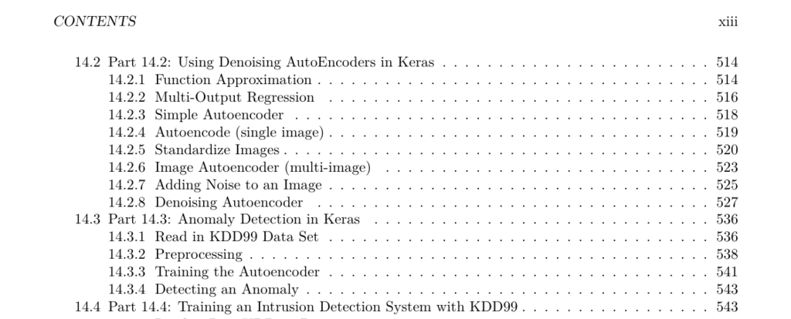

- **0.1 Introduction**
  - Deep learning is a set of technologies enabling neural networks to handle diverse data types including tabular data, images, text, and audio.
  - It allows neural networks to learn hierarchical information similarly to the human brain.
  - The course covers architectures such as CNN, LSTM, GRU, GAN, and reinforcement learning with applications in vision, time series, NLP, and data generation.
  - High-performance computing concepts demonstrate leveraging GPUs and grids.
  - Python with TensorFlow and Keras is used for practical deep learning implementation.
  - Further reading: [Deep Learning](https://www.deeplearningbook.org/)

- **Chapter 1: Python Preliminaries**
  - **1.1 Part 1.1: Course Overview**
    - The course introduces advanced neural network architectures and high-performance computing in deep learning.
    - Assignments encompass individual and team projects spanning various topics from data preparation to time series modeling.
    - The instructor is Jeff Heaton, an experienced researcher and practitioner with extensive credentials.
    - Resources include Google CoLab, Anaconda, Jupyter Notebooks, TensorFlow, Kaggle, and a GitHub repository.
    - Further reading: [Jeff Heaton's Blog](https://www.heatonresearch.com/)
  - **1.1.4 What is Deep Learning**
    - Deep learning involves training deep neural networks efficiently, allowing multiple layers unlike earlier networks.
    - It builds on traditional neural networks but enables effective training of complex architectures.
    - Further reading: [Geoffrey Hinton's Deep Learning Lecture](https://www.cs.toronto.edu/~hinton/coursera_lectures.html)
  - **1.1.5 What is Machine Learning**
    - Machine learning uses models that learn to produce desired outputs from inputs, replacing rule-based programming.
    - It applies across predictive modeling, computer vision, and time series analysis.
    - Further reading: [Machine Learning Crash Course](https://developers.google.com/machine-learning/crash-course)
  - **1.1.6 Regression**
    - Regression models predict numeric outputs from inputs, such as MPG predictions from car features.
    - Neural networks can infer such formulas from data instead of manual programming.
  - **1.1.7 Classification**
    - Classification models assign inputs to categories, exemplified by predicting iris species from flower measurements.
  - **1.1.8 Beyond Classification and Regression**
    - Neural networks can produce outputs in various formats including images, sequences, regression values, or classification classes.
  - **1.1.9 What are Neural Networks**
    - Neural networks originated in the 1940s and had resurgence with improved training methods since 2006.
    - Key contributors are Yann LeCun, Geoffrey Hinton, Yoshua Bengio, and Andrew Ng.
    - Hinton, LeCun, and Bengio won the Turing Award for deep learning contributions.
  - **1.1.10 Why Deep Learning?**
    - Deep learning offers advantages like processing images with CNNs and sequential patterns with RNNs.
    - It supports diverse data types for input and output, unlike other models.
    - Further reading: [Andrew Ng on Deep Learning](https://www.deeplearning.ai/)
  - **1.1.11 Python for Deep Learning**
    - Python 3.x is the core programming language used due to its dominant support in deep learning.
    - TensorFlow/Keras and PyTorch are the primary frameworks.
  - **1.1.12 Software Installation**
    - Students must install Python, TensorFlow, and IDEs or use Google CoLab for coding.
    - Installation steps apply similarly across Windows, Linux, and macOS.
  - **1.1.13 Python Introduction**
    - Important Python packages used include Anaconda, Jupyter Notebooks, PyCharm IDE, and Matplotlib.
  - **1.1.14 Jupyter Notebooks**
    - Jupyter Notebooks support mixing executable Python code and Markdown for documentation, with LaTeX math support.
  - **1.1.15 Python Versions**
    - Python 3 syntax is required, including parentheses in print statements and using range instead of xrange.
    - Code samples provided for verifying Python and package versions.
  - **1.1.16 Module 1 Assignment**
    - The first assignment is available and introduces submission processes.
  - **1.2 Part 1.2: Introduction to Python**
    - Python is a high-level, interpreted language emphasizing readability with significant whitespace.
    - Python 3 is used due to ongoing support and compatibility with TensorFlow.
    - Basic constructs covered include printing, comments, variables, strings, numbers, if-statements, and loops.
    - Python uses indentation, and whitespace is significant for code blocks.
    - Further reading: [Official Python Tutorial](https://docs.python.org/3/tutorial/)
  - **1.3 Part 1.3: Python Lists, Dictionaries, Sets and JSON**
    - Python collections include lists (ordered, mutable), tuples (ordered, immutable), sets (unordered, no duplicates), and dictionaries (key-value pairs).
    - Lists allow duplicates and dynamic size; tuples do not allow modification.
    - Sets contain unique elements; dictionaries store named fields accessible by keys.
    - Combinations of lists and dictionaries enable complex, hierarchical data structures.
    - Python supports zip, enumerate, list comprehensions, and dictionary comprehensions for collection manipulation.
    - JSON is a hierarchical data format using lists and dictionaries with double quotes; Python supports JSON parsing and generation.
    - Further reading: [Python JSON Documentation](https://docs.python.org/3/library/json.html)
  - **1.4 Part 1.4: File Handling**
    - File handling is essential for AI to load training or real-time data from CSV, images, text, JSON, audio, and H5 files.
    - Data can reside on local drives, the internet, or cloud platforms like Google Drive.
    - Pandas reads CSV files fully into memory, with example code loading the Iris dataset.
    - Streaming large files can be done by processing line-by-line to handle memory constraints.
    - Text files can be read line-by-line similarly.
    - The Python PIL package facilitates image loading from URLs.
    - Further reading: [Pandas IO Tools](https://pandas.pydata.org/pandas-docs/stable/user_guide/io.html)
  - **1.5 Part 1.5: Functions, Lambdas, and Map/Reduce**
    - Functions capture reusable code with named or unnamed parameters and optional defaults.
    - Map applies a function over a list producing a list of results; list comprehensions can achieve similar effects.
    - Filter creates a sublist based on a predicate function.
    - Lambda functions provide concise unnamed functions primarily for single-expression logic.
    - Reduce aggregates list elements into a single value by applying a binary function repeatedly.
    - Further reading: [Python Functions Tutorial](https://realpython.com/defining-your-own-python-function/)
