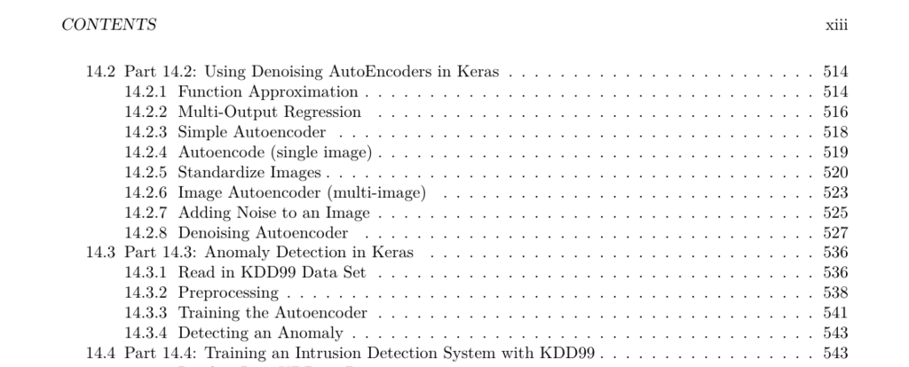

- **0.1 Introduction**
  - Deep learning enables neural networks to process tabular data, images, text, and audio as inputs and outputs.
  - It allows learning of hierarchical information, similar to the human brain function.
  - The course covers classic neural networks, CNN, LSTM, GRU, GAN, and reinforcement learning.
  - Applications include computer vision, time series, security, NLP, and data generation.
  - Instruction includes Python with TensorFlow and Keras; prior Python knowledge is not mandatory.
  - Further reading: [Deep Learning Specialization](https://www.coursera.org/specializations/deep-learning)

- **Chapter 1 Python Preliminaries**
  - **1.1 Course Overview**
    - Introduces deep belief networks, ReLU units, convolutional and recurrent neural networks.
    - Covers HPC leveraging GPUs and grids for deep learning.
    - Focus on practical deep learning application with some theoretical foundations.
    - Uses Python programming for building and interpreting neural networks.
    - Assignments include individual tasks, Kaggle projects, and team final projects.
    - Instructor: Jeff Heaton, PhD, with industry and academic credentials.
    - Course resources include Google Colab, Anaconda, Jupyter, TensorFlow, Kaggle, and GitHub.
    - Further reading: [TensorFlow Documentation](https://www.tensorflow.org/)

  - **1.2 Introduction to Python**
    - Python 3.x is the chosen language due to its extensive deep learning support.
    - Emphasizes code readability with significant whitespace for block definitions.
    - Demonstrates basic syntax: printing, comments, literals (strings and numbers), variables, and formatted strings.
    - Covers control flow with if-else statements, loops with range, and managing indentation.
    - Highlights differences between Python 2 and 3 syntax.
    - Further reading: [Python Official Tutorial](https://docs.python.org/3/tutorial/)

  - **1.3 Python Lists, Dictionaries, Sets and JSON**
    - Lists: mutable, ordered collections allowing duplicates.
    - Tuples: immutable, ordered collections allowing duplicates.
    - Sets: mutable, unordered collections disallowing duplicates.
    - Dictionaries: mutable unordered collections mapping keys to values.
    - JSON is a human-readable semi-structured format consisting of nested lists and dictionaries.
    - Python provides native JSON support, enabling parsing and generation of JSON data.
    - Further reading: [Python JSON Module](https://docs.python.org/3/library/json.html)

  - **1.4 File Handling**
    - File types important for AI include CSV, image, text, JSON, H5, and audio files.
    - Data sources include local hard drives, internet URLs, and Google Drive (especially in Colab).
    - Pandas can easily read CSV files for tabular data processing.
    - Streaming large files row-by-row conserves memory and allows handling large datasets.
    - Images can be loaded and displayed using PIL and requests libraries.
    - Further reading: [Pandas IO Tools](https://pandas.pydata.org/pandas-docs/stable/user_guide/io.html)

  - **1.5 Functions, Lambdas, and Map/Reduce**
    - Functions enable code reuse with named or default parameters.
    - Map applies a function to each element in a list, returning a list of the same size.
    - Filter creates a smaller list by selecting elements matching a condition.
    - Lambda expressions provide unnamed, concise functions for quick operations.
    - Reduce aggregates a list to a single value using a binary function, such as sum.
    - Further reading: [Python functools reduce](https://docs.python.org/3/library/functools.html#functools.reduce)
