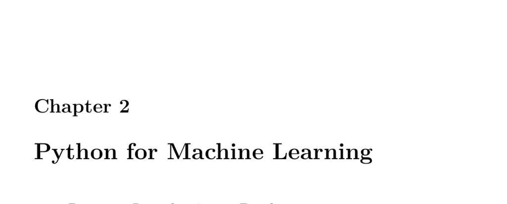

- **2.1 Part 2.1: Introduction to Pandas**
  - Pandas is an open-source Python library offering high-performance data structures and analysis tools based on data frames.
  - The Auto MPG dataset from UCI is used for demonstration, containing data for 398 cars with various attributes.
  - Code examples show how to load, display, and generate statistical summaries of data frames.
  - Techniques to handle missing values include replacing them with the median; outliers can be removed using standard deviation thresholds.
  - Data concatenation, dropping irrelevant fields, and training-validation splits (80/20) are demonstrated.
  - Conversion of data frames to numeric matrices and saving to CSV or Pickle formats are detailed.
  - See [Pandas Documentation](https://pandas.pydata.org/pandas-docs/stable/) for comprehensive information.

- **2.2 Part 2.2: Categorical and Continuous Values**
  - Inputs to neural networks must be numeric; data is classified as nominal, ordinal (categorical), or interval, ratio (numeric).
  - Continuous values can be normalized using Z-scores computed from mean and standard deviation.
  - Categorical variables are encoded using dummy variables (one-hot encoding) or target encoding, the latter potentially increasing predictive power but with higher overfitting risk.
  - Ordinal categorical variables maintain inherent order and can be encoded using incremental numeric values.
  - Code examples demonstrate creating dummies and performing target encoding with smoothing weights.
  - Refer to [Target Encoding Done the Right Way](https://www.kaggle.com/code/prashant111/target-encoding-done-right) for advanced target encoding techniques.

- **2.3 Part 2.3: Grouping, Sorting, and Shuffling**
  - Shuffling data sets removes order biases that could affect training and validation splits, done by permutation and reindexing.
  - Sorting organizes data by one or more columns to facilitate analysis or preprocessing.
  - Grouping summarizes data like SQL’s GROUP BY, allowing aggregate functions such as mean and count.
  - Examples include grouping Auto MPG data by cylinders with computed mean mpg values, key to target encoding and data summarization.
  - Visit [Pandas GroupBy Documentation](https://pandas.pydata.org/pandas-docs/stable/user_guide/groupby.html) for detailed group operations.

- **2.4 Part 2.4: Apply and Map**
  - The `map` function transforms column values using dictionaries for direct substitutions, demonstrated by renaming numeric origin codes to regional strings.
  - The `apply` function runs arbitrary functions across rows or columns, supporting lambda expressions for feature creation like efficiency ratios.
  - Feature engineering is illustrated using IRS zip code income data, calculating weighted AGI estimates via grouping and aggregation.
  - Techniques combine map, apply, and groupby functions for advanced transformations.
  - Consult [Pandas Apply Documentation](https://pandas.pydata.org/pandas-docs/stable/reference/api/pandas.DataFrame.apply.html) for further details.

- **2.5 Part 2.5: Feature Engineering**
  - Feature engineering includes creating new fields calculated from existing columns, e.g., converting weight from pounds to kilograms.
  - External APIs can aid encoding, such as Google API keys enabling geocoding of addresses into latitude and longitude.
  - Distance calculations between coordinates using the great circle formula enhance spatial feature creation for machine learning models.
  - Use cases include measuring distances to metropolitan areas, competitors, or retail outlets for enriched data representations.
  - Additional context and examples are available at [Google Maps API Documentation](https://developers.google.com/maps/documentation/geocoding/start).
